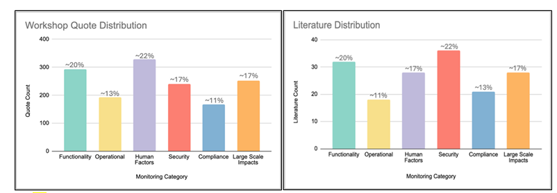
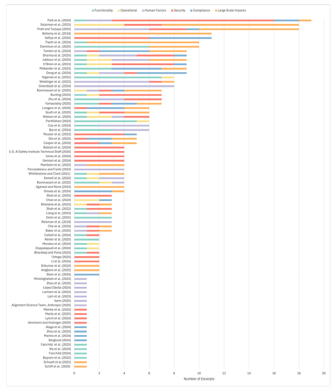

# AI NIST AI 800-4 Challenges to the Monitoring of Deployed AI Systems

**Published:** March 2026  
**Document Type:** NIST Pubs Report   

---

## Executive Summary

As artificial intelligence (AI) is increasingly integrated into commercial and government applications, developers and deployers have begun to monitor these systems after deployment. AI evaluations conducted prior to release-called 'predeployment'evaluations are now common, and valuable to assess the capabilities and risks of an AI system; however, these evaluations are predominantly done in controlled testing environments that cannot account for real-world dynamics. Furthermore, AI outputs are typically non-deterministic, meaning the AI may exhibit a range of behaviors under the same input conditions.postdeployment measurement and monitoring is therefore a crucial tool (1) to validate that an AI system is operating reliably and as expected in realworld scenarios, (2) to track unforeseen outputs that occur due to, e.g., model non-determinism or dynamic input conditions, and (3) to identify unexpected consequences of integrating AI systems in new or changing contexts. These findings can then feed back into improvements of system design andpredeployment testing, accelerating innovation and spurring further adoption. Stakeholders across the AI ecosystem agree on the need for postdeployment monitoring; however, best practices, validated methodologies, and common terminology is nascent. To address this, in 2025 the Center for AI Standards and Innovation (CAISI) within NIST held two workshops onpostdeployment AI system monitoring with external stakeholders and federal agencies, followed by a larger workshop with the NIST AI Consortium. These convenings included a wide range of AI stakeholders, including compute providers, model developers, downstream deployers, application developers, and third-party evaluators. In parallel, a literature review was conducted to gather (1) published case studies of AI system monitoring in real-world applications and (2) methodologies or frameworks for AI measurement postdeployment. Literature excerpts and participant contributions were organized into six monitoring categories and a host of monitoring challenges (gaps, barriers, and open questions). Section 1 of this report introduces this work, including a definition ofpostdeployment AI system monitoring and an overview of the research methodology and contributions. Further methodological details are provided in Appendix B. Section 2 introduces the six monitoring categories to support a more organized discussion and field of work onpostdeployment monitoring (Table 1):

- Functionality Monitoring: Does the system continue to work as intended?
- Operational Monitoring: Does the system maintain consistent service across its infrastructure?
- Human Factors Monitoring: Is the system transparent to humans and high quality?
- Security Monitoring: Is the system secure against attacks and misuse?
- Compliance Monitoring: Does the system adhere to relevant regulations and directives?
- Large-Scale Impacts Monitoring: Does the system promote human flourishing?

Section 3 details the challenges to robustpostdeployment AI system monitoring, organized into the following groups:

- Cross-Cutting Challenges (Table 2): Notable challenges that are shared across monitoring categories, e.g., a lack of information sharing related to data, model components, and incidents, and difficulties with rapidly scaling up systems and hiring an AI-ready workforce.
- Category-Specific Challenges (Table 3): Notable challenges that apply to particular monitoring categories, e.g., detecting drift, logging across distributed infrastructure, capturing human-AI feedback loops, identifying deceptive behavior, navigating a complex policy landscape, and defining metrics for beneficial impacts to humans.
- Open Questions (Table 4): Unsettled questions in AI system monitoring related to, for example, mitigating user-side burden, determining the optimal cadence for monitoring, and balancing automated vs. human-validated monitoring.

The identification and documentation of challenges to the monitoring of deployed AI systems and the reporting of views expressed by experts in the field are the primary contributions of this report. These gaps, barriers, and open questions highlight opportunities for further investigation and innovation. Notably, this report raises practitioners'repeated calls for further guidance onpostdeployment AI system monitoring methods, from field studies to incident monitoring. The findings of this report are not exclusive, but have a particular relevance, to frontier generative AI systems.

## 1. Introduction

Artificial intelligence (AI) is being developed, deployed, and adopted at an increasing rate. [1, 2] The technology has been integrated into major products and services, serving billions of people and adopted by many companies and organizations across sectors. AI evaluations are now common prior to release to assess the capabilities and risks of the system [3, 4]. These predeployment evaluations, while valuable, are predominantly conducted in controlled testing environments which are inherently limited. For example, AI outputs are typically nondeterministic, meaning the AI may exhibit subtly or even vastly different behavior under the same input conditions. Additionally, this does not take into account the dynamic and myriad variations of interactions that would occur in real use. It is therefore necessary to complementpredeployment evaluations with repeated testing, evaluation, validation, and verification after a system is deployed [5, 6, 7, 8]. Measurements of AI systems after they are deployed-from field studies to incident monitoring-are necessary to track if risks materialize, and to obtain signals from real-world use to feed back into the process of building mitigations, developing new systems, and evaluating before deployment [9, 10]. It has been shown that AI models in real-world contexts do not always perform as expected based on testing done in silico or in smaller testing environments [11], even with the most rigorous and extensivepredeployment testing [12]. Postdeployment issues include reports of, for example, hallucination [13], sycophantic behavior [14], security exploits [15], and false claims [16]. In some instances, models have been found to detect when they are being evaluated, therefore raising the suspicion that these models operate differently under test conditions than in deployed settings [17]. In addition, the variability introduced by AI models, coupled with the many system components ( e.g., cloud servers, GPUs, tools, classifiers) and user interactions, forms a large attack surface [18]. The complexity of the environment in which AI systems are deployed further implies an expansive monitoring surface, motivating the need for robust and reliablepostdeployment monitoring and an ecosystem of best practices, methods, and tools for doing so. [^1] The practice of monitoring software systems after they are deployed precedes modern AI systems. The idea of embedding monitoring into the development lifecycle through automated testing, known as 'shifting left'( i.e., moving quality assurance tasks earlier in the pipeline) [20] is common practice in fields such as development operations ( a.k.a. 'DevOps'). Indeed, by 2008, the software development field was coalescing around DevOps for quality assurance across the software delivery lifecycle [21]. This was later followed by MLOps for automated monitoring of traditional machine learning systems [22]. Still, it's important to note that these tools cover only a small collection of the measures required to monitor more advanced AI systems. [^2]

To meet demand for monitoring of deployed generative AI systems, the marketplace of AI monitoring tools is quickly expanding, ranging from proprietary [25, 26, 27] to open-source offerings [28, 29]. Best practices are continuing to evolve as new tools, methods, and contexts for monitoring emerge. This report aims to advance the field by offering an overview of postdeployment AI system monitoring, identifying common categories of monitoring, and highlighting gaps, implementation barriers, and open questions across the AI monitoring ecosystem.

## 1.1 Definition: Postdeployment AI System Monitoring

'Postdeployment AI system monitoring'can refer to a large breadth of topics and activities. For the purposes of this report, the scope is monitoring of an AI system itself, as opposed to measures that focus on monitoring the AI ecosystem, such as measuring adoption. With this in mind, we define the below terms as follows:

- postdeployment constitutes the period after an AI system is put into at least partial working operation in production or application.
- Monitoring refers to any type of measurement, potentially 'continuous,'[^3] such as tracking, evaluation, data collection, or information gathering.
- For tractability, this report is limited to practices which aim to measure an AI system and immediate interacting components, as opposed to practices or measurements that focus on, for example, societal indicators, broader economic trends, or diffusion of AI models. Furthermore, this report has particular relevance to frontier, generative AI systems.[^4] For purposes of clarity and concision, the term 'AI system monitoring'will be used in this report to denote monitoring activities conducted in thepostdeployment phase, unless otherwise specified.

## 1.2 Methodology

CAISI conducted a preliminary literature review with an initial set of 23 papers covered by two inclusion criteria: (1) the paper contains example(s) of real-world monitoring case studies or use cases, or (2) the paper advances the science of measuring AI systemspostdeployment ( e.g., contains notable benchmarks, KPIs, frameworks, taxonomies, methods). These papers were used to construct a draft taxonomy of monitoring categories. Subsequently, CAISI held three workshops onpostdeployment AI system monitoring from April to May 2025 to investigate motivations and targets for monitoring, as well as notable gaps, barriers, and open questions inpostdeployment AI system monitoring. Through recursive backchaining of paper citations and resources collected from workshop attendees, the literature review grew to include a larger set (87 papers in total, see Appendix A).

Finally, workshop participant quotations were thematically coded by two reviewers into monitoring categories (see Section 2 for categories and Appendix C for the full codebook) and monitoring challenges (detailed in Section 3). In parallel, excerpts from the included literature were coded into these same classifications. Our coding approach utilized an inductive methodology to uncover patterns and themes from data [31, 32, 33, 34]. A more detailed description of the methodology can be found in Appendix B. Related work spans areas including third-party evaluation ( e.g., Stein et al. [35]), analysis of user data ( e.g., Chatterji et al. [36]), adverse event reporting ( e.g., Agarwal and Nene [37]), security ( e.g., Musser et al. [38]), compliance ( e.g., Marino et al. [39]), risk assessment and risk management ( e.g., López-Dávila [40]), and other fields. While research in these areas can be disjointed, several works such as Stein and Dunlop [41], Pratt and Tanjaya [42], and others ( e.g., Ezell and Lobel [43], e.g., Whittlestone and Clark [44]), undertake the task of analyzing the postdeployment monitoring ecosystem and consolidating relevant insights in a manner related to this report.

## 1.3 Contributions

This report proposes six monitoring categories and an organized list of challenges to robust monitoring of deployed AI systems. While the monitoring categories were developed with the goal of supporting a more organized discussion and field of work onpostdeployment monitoring (Section 2), the primary contributions of this report are the identification and documentation of monitoring challenges, and reporting of views expressed by experts in the field (Section 3). The identified gaps, barriers, and open questions highlight opportunities for further investigation and innovation.

## 2. Monitoring Categories

The monitoring categories presented in Table 1 below [^5]  were derived from three NIST workshops and literature review. Each definition is specific topostdeployment or production settings. See Appendix C for a full codebook associated with the monitoring category definitions.

**Table 1 Monitoring categories and definitions**

| Monitoring Category | Definition |
| --- | --- |
| Functionality Monitoring: Does the system continue to work as intended? | Measuring system functions, capabilities, and features, for example to ensure the system continues to work as intended |
| Operational Monitoring: Does the system maintain consistent service across its infrastructure? | Measuring system infrastructure components, for example to ensure the system maintains consistent levels of service |
| Human Factors Monitoring: Is the system transparent to humans and high quality? | Measuring human-system interactions, for example to ensure the system produces high-quality outputs and is transparent |
| Security Monitoring: Is the system secure against attacks and misuse? | Measuring where the system is potentially vulnerable to adversarial attacks and misuse |
| Compliance Monitoring Does the system adhere to relevant regulations and directives? | Measuring system components for adherence to relevant laws,regulations,standards,controls,and guidelines |
| Large-Scale Impacts: Monitoring Does the system promote human flourishing? | Measuring system properties that have wide downstream impacts, for example to ensure the system promotes human flourishing6 [^6] |

Figure 1 below shows the distribution of workshop quotations and literature (with at least one excerpt) coded by monitoring category. The distribution shows:

1. A smaller proportion of the workshop quotations and literature excerpts covered operational and compliance monitoring.
2. Compared to literature excerpts, workshop attendees had a larger proportion of quotations related to human factors monitoring.
3. Inversely, a larger share of literature excerpts in this review were related to security monitoring compared to workshop quotations.

### Figure 1 Distribution of monitoring topics extracted from literature and workshops. For each monitoring category, the left chart shows the number of workshop participant excerpts coded by category. The right chart shows the number of papers with at least one excerpt coded into the category.

> ### **Technical Description: Distribution of AI Monitoring Topics**
> **Summary:** This side-by-side bar chart comparison illustrates the distribution of AI monitoring topics identified across workshop participant quotations and academic/technical literature. It highlights the thematic focus shift between practitioner perspectives (workshops) and research-oriented perspectives (literature).
> 
> *   **Workshop Quote Distribution (Practitioner Focus):**
>     *   **Primary Themes:** Human Factors (~22%) and Functionality (~20%) represent the highest areas of concern.
>     *   **Secondary Themes:** Security and Large Scale Impacts both sit at ~17%.
>     *   **Lower Priority:** Operational monitoring (~13%) and Compliance (~11%) received the least amount of coding.
> *   **Literature Distribution (Research Focus):**
>     *   **Primary Themes:** Security (~22%) and Functionality (~20%) are the most frequently discussed topics in the literature review.
>     *   **Secondary Themes:** Human Factors and Large Scale Impacts are tied at ~17%.
>     *   **Lower Priority:** Compliance (~13%) and Operational monitoring (~11%) show the smallest share of literature excerpts.
> *   **Comparative Analysis:** Workshop attendees prioritize human factors (22% vs 17% in literature), while literature places a significantly higher emphasis on security monitoring (22% vs 17% in workshops). Both datasets reflect a relatively lower focus on operational and compliance categories.
>
> **Keywords:** AI Monitoring Taxonomy, Workshop Quotations, Literature Review, Human Factors, AI Security, Operational Monitoring, Compliance Monitoring, Functionality Monitoring, Large Scale AI Impacts, Monitoring Topic Distribution.

See Appendix A, Figure A.1, for a similar thematically-coded count in the literature review.

## 3. Monitoring Challenges

Workshop attendees (hereafter 'attendees') were asked to describe (a) current gaps they saw inpostdeployment system monitoring across the ecosystem, (b) barriers to effective monitoring, and (c) open questions that exist for monitoring AI systems. Excerpts from literature were also categorized into gaps, barriers, and open questions, where:

- Gaps are defined as notable areas that are either under-explored or lack sufficient attention.
- Barriers are defined as known challenges or obstacles to achieving high-quality, rigorouspostdeployment monitoring.
- Open questions are unsettled or unanswered questions on aspects of conducting monitoring.

n.b., The distinction between a gap, barrier, and open question can be ambiguous, and these categories do overlap. There is value in separating these types, as they indicate different features in the landscape, and different types of opportunities for further research. Thus, excerpts were sorted respectively to the extent possible. In organizing the challenges detailed in this report it was surfaced that certain challenges in AI system monitoring are shared, regardless of what one is monitoring for (see Table 2). The need for improved incident reporting guidelines, for example, is often discussed in security contexts, but was raised as applying to other categories of monitoring such as large-scale impacts. A similar story holds for incentive barriers and resource constraints, which exist across monitoring categories. Further, this report shows a disparity in the number and range of challenges for specific categories of monitoring. For example, the wider range of human-factors monitoring challenges identified in comparison to other categories (see Table 3), when coupled with the larger proportion of workshop quotes in comparison to the literature (shown in Figure 1), could signal that human-factors monitoring is relatively underexplored (Section 3.2.3). For functionality monitoring, challenges expressed appear less concerned with identifying what targets to monitor, which could vary by use case, and reflect a stronger interest in determining how to monitor those targets using the best methods and tools (Section 3.2.1). Conversely, challenges linked to compliance monitoring appear primarily focused with what to monitor for, and less with how to monitor said targets (Section 3.2.5). As previously mentioned, AI system monitoring is a growing and evolving area of work, and therefore it is reasonable to expect there to be many gaps yet to be filled, barriers yet to be addressed, and open questions not yet resolved. The goal of this work is to document and organize these challenges, so they can be efficiently addressed by the field. Note: In this document, attendee quotations are near-verbatim, i.e. taken from notes, and are designated by being in quotes and italics. Quotations not from workshop attendees are not in italics and have a designated source. All quotations from workshop attendees are and will remain anonymous. [^8]

## 3.1 Cross-Cutting Monitoring Challenges

This section lists monitoring gaps and barriers that apply across all monitoring categories, as reflected by statements from the workshop attendees and the literature. Five broad categories of challenges were identified, summarized in Table 2 below: (1) trusted methods and tools, (2) visibility and transparency, (3) pace of change, (4) incentives and organizational culture, and (5) resource requirements.

**Table 2: Cross-cutting monitoring challenges (gaps and barriers) identified by workshop participants and in the literature review**

| Challenge Categories | Gaps and Barriers |
| --- | --- |
| Trusted Methods and Tools | Gap: Lack of trusted guidelines or standards for methods and tools, Barriers: Monitoring is use-case-specific; Uncertainty and variability in results from models; Monitoring may infringe security and privacy |
| Visibility and Transparency | Gap: Lack of direct visibility into model properties; Immature information sharing ecosystem |
| Pace of Change | Barriers: Rapidly shifting landscape across the Al stack; Scaling human-driven monitoring alongside rapid rollouts |
| Incentives and Organizational Culture | Barriers: Balancing competitive pressures with necessary oversight; Lower prioritization for ecosystem-wide transparency; Administrative burden |
| Resource Requirements | Barriers: Financial costs and compute/human resources; Hiring and training qualified Al experts |                                                                                               |

## 3.1.1 Trusted Methods and Tools

In the workshops and literature, practitioners discussed challenges related to trusted methods and tools. These included a lack of trusted guidelines or standards for monitoring methods and tools, and the challenges of monitoring being use-case-specific, that it may infringe security and privacy, and of there being uncertainty and variability in the monitoring results.

### Gap: Lack of trusted guidelines or standards for the use of methods and tools for monitoring

Attendees generally described an unfulfilled need forpostdeployment monitoring standards and guidelines, e.g., stating there is'a lack of standards to monitorpostdeployment monitoring against.'The absence of standards and need for practical instructions are also recurring themes in the literature ( e.g., see [46, 47, 48, 49, 50]). One attendee highlighted the dearth of universal security monitoring standards, stating the need for'cross-provider standardization: an abstraction layer is required for universal security and monitoring.'Other examples included the 'lack of standards for modular development'and'lack of web standards or sustained Community of Practice for discovering AI-enabled sites or the models they use. e.g., OAuth Discovery endpoints'(notably, South et al. [51] propose a framework extending OAuth 2.0 [^7] for agent-specific credentials). Kemell et al. [52] note that 'current operation practices provide limited guidance'despite the 'strong desire for continuously monitoring and validating AI systems post deployment for ethical requirements.'López-Dávila [41] points out discrepancies in existing standards, in which 'assessed [ISO] standards do not align with the [EU] AI Act on what they [mean] by AI systems.'In terms of identifying trusted monitoring tools, attendees mentioned the lack of pre-vetted thirdparty tools or knowledge of how to find them ('Are there aftermarket thirdparty/commercial tools available for monitoring? Has anyone assessed them? '). Whittlestone and Clark [44] echo the 'need to improve tools and establish more continuous measurement.'In terms of identifying trusted monitoring methods, Kemell et al. [52] note the broad range of monitoring-related literature, and the possibility that methods for monitoring could be contained in 'relevant research that is simply framed differently.'In other words, standardized monitoring methods for AI systems are a gap, but it is possible that relevant research on monitoring methods in non-AI contexts may be getting overlooked. Attendees stated there is a lack of clarity around what measurement targets to monitor:'It's often unclear what exactly to monitor and how.'The literature supports this concern, e.g., Srikumar et al. [46] note it can be 'unclear what to measure,'and describe the 'lack of overall postdeployment information and [standardized] processes to collect'measurement targets. Morales et al. [53] highlight that the 'appropriate metrics to capture is not standardized in the AI community'and warn this 'absence can result in misleading performance measures.'Attendees further noted the lack of guidance for incident or flaw 8  reporting and response ('Unclear… what the plan is for when an anomaly is detected (what to do with that information) '). Cattell et al. [54] underscore this issue of missing standardized procedures for AI flaw reporting, identifying poor 'model card standardization'as an underlying issue. Additionally, while AI incident databases are available, [^9] 'each [incident reporting] database uses its own criteria'according to Agarwal and Nene [38].

### Barrier: Monitoring is use-case-specific

A notable barrier to monitoring is that it can be largely use-case-specific. Rosenthal et al. [58] and Srikumar et al. [46] emphasize this concern, stating: 'Oversight is necessary to govern appropriate use of dynamic AI systems, and these decisions will be highly contextdependent'and't he effectiveness of [monitoring] measures varies across sectors.'Zhou et al. [47] notes, as a caveat, that one cannot 'expect the AI system to work well for every input…depending on the context, there might be value if [the system] just works for some inputs.'Tamkin et al. [59] state that 'patterns and insights derived [from the Clio monitoring tool] may not generalize to other AI systems, whose underlying capabilities, applications, and user bases may differ considerably.'Some workshop attendees took this issue a step further, underscoring the ways in which diverse use cases, which may rely on use-case-specific metrics, hinder the development of standardized monitoring tools ('Non-standardized logic for generating metrics across use cases prevents us from building easy platform capabilities for monitoring ').

### Barrier: Monitoring may infringe security and privacy

Attendees inquired about how to conduct monitoring securely-for example:'How to conduct monitoring in an air-gapped, secure environment? '-as well as about security and privacy risks that could stem from the process of monitoring itself:'Can we have system reliability by reviewing system logs, and how do we do that in a privacy preserving manner?'Bluemke et al. [60] directly motivate this scenario: 'As the use of AI in sensitive applications expands, models will increasingly interact with private information (e.g., language models used in therapy apps).'One attendee highlighted the difficulty of'maintaining a balance between not invading [user] privacy and at the same time enabling transparency of the system.'Srikumar and Schuett echo this challenge [46, 61]. In the context of AI agents, Chan et al. [72 ] describe how '[user] privacy could still be compromised'even when 'an identifier by itself would not reveal anything about its user,'e.g., 'timestamps and details of an instance's activitiesas might be contained in incident reports-could help a thirdparty to identify users.'Tamkin et al. [59] describe this as a 'privacy vs. granularity trade-off.'[^10] 

### Barrier: Uncertainty and variability in results from models

Attendees noted that quantifying uncertainty is still a gap area ('Measuring and… recording [monitoring] uncertainty is extremely important and underappreciated, in fact, ignored. '). CAISI's prior work has noted the non-deterministic nature of AI agents: 'if a user instructs an AI agent to perform the exact same task twice, it's possible that the agent will produce different results each time'[63]. In the context of the HELM (Holistic Evaluation of Language Models) benchmark, Liang et al. [64] suggest that 'expression of model uncertainty is especially critical for systems to be viable for deployment in highstakes settings.'

## 3.1.2 Visibility and Transparency Issues

The workshops and literature revealed ongoing issues with visibility and transparency of AI systems within the monitoring ecosystem. These included an immature ecosystem for information sharing and a lack of direct visibility into model properties, such as data use, model components, etc.

### Gap: Immature information sharing ecosystem

Workshop attendees identified information sharing challenges, e.g.,'What does the information sharing of what's measured look like up and down the value chain? Under what circumstances are things reported up vs down [and] how do we go about that?'[^11] Attendees called out the general need to 'get more [information] into the public's hands.'This pertains to both information about AI systems broadly as well as the systems and processes that are used to monitor them. Bommasani et al. [66] highlight 'lack of information sharing'as a persisting issue in the 2024 Foundational Model Transparency Index [^12] : 'developers…do not know how their foundation model is being used unless a deployer monitors use or receives and shares information about use from its customer.'Manheim et al. [49] suggest that ongoing monitoring should be a 'public process that tries to anticipate future misuse rather than reacting as new implicit capabilities are discovered.'

Some attendees focused on monitoring for incidents [^13], with one asking 'How do we share incidents across the industry to collectively improve?'As noted previously, the lack of standardized guidance on AI incident sharing can hinder valuable information being communicated across the ecosystem. Longpre et al. [68] point to 'a lack of a centralized reporting entity'and a 'lack of infrastructure [to take collective action] in response to serious flaws'as existing gaps in incident reporting. Attendees expressed confusion about mechanisms for different forms of incident reporting ('Where do I report model behavior vs traditional security vulnerabilities? Unclear still. '). Paeth et al. [69] note the ambiguity around the term 'AI incident'as a 'a relatively new term'that lacks clear definition, which contributes to the lack of clarity around reporting. Attendees also highlighted the tendency to over-index on newsworthy incidents in incident reporting and sharing:'Current monitoring efforts seem to be aimed at incident monitoring, [and incidents] themselves are so dependent on news coverage.'

### Gap: Lack of direct visibility into model properties (for example, data use, model components, model reasoning, and external contexts)

The literature highlights ways in which limited visibility into model components can pose obstacles for monitoring. Che et al. [48] describe the 'growing consensus that access to model internals is necessary for rigorous evaluations.'While Che et al. are referring to predeployment contexts, this extends topostdeployment contexts as well. Baker et al. [70] describe a specific example related to model interpretability: '…while chain-of-thought monitoring has shown promising early signs, further research is necessary to determine the most effective ways to construct monitors and employ them.'Attendees also a sked about monitoring system explainability ('[we] need to think about explainability of behavior ') in the context of reversing negative outcomes ('If harm arises, is there some way to backtrack? '). The literature and workshop attendees also describe the necessity of visibility into other components of an AI system, external to the model. For example, Srikumar et al. [46] note 'developers, hosts and providers have only partial information'for post-deployment monitoring. Attendees discussed the challenging dynamic of conducting third-party application monitoring, due to poor visibility into how external applications leverage model outputs, inputs, and other sources of data ('Third party provider applications… we just don't have visibility into what they will do with our data nor the application trustworthiness. '). Having access to data or other information needed for monitoring was another concern that attendees described as'information asymmetry in monitoring.'Shah et al. [71] share monitoring examples that underscore data access issues: teams were instructed to detect a model's hidden objective, however 'success relied heavily on access to samples of the training data'and 'the team without data access failed.'Pratt and Tanja ya [42] emphasize legal challenges that hinder information sharing as well: 'activity logs may contain personal data which cannot legally be shared without consent, and privacy commitments to enterprise customers may block sharing information.'In certain enterprise cases, the workforce may have access to authorized AI tools but may still choose to use AI services on their personal accounts for certain queries.'Not knowing who's using what systems where, including… on personal devices'poses a real challenge to monitoring in enterprise use cases. Visibility into unanticipated agent activity, particularly as the use of agent identifiers is not yet standardized or mature, is an emerging challenge ('How to track OOD (out-of-distribution) behavior using agent identifiers? '). Chan et al. [72] note various difficulties with implementing identifiers to track agent behavior, depending on format of the agent outputs, e.g., 'adversarial users may easily remove watermarks'for AI-generated text. South et al. [51] echo similar limitations with 'watermarking techniques and content provenance measures,'noting they 'face reliability challenges and are insufficient for establishing comprehensive accountability…when using AI agents.'

## 3.1.3 Pace of Change

Workshop attendees and researchers noted obstacles to monitoring while undergoing internal and external changes to the organization. Barriers included scaling human-driven monitoring alongside rapid rollouts to users and adjusting to a rapidly shifting landscape across the AI stack.

### Barrier: Scaling human-driven monitoring alongside rapid rollouts

As systems scale in production due to new users being onboarded or additional locations being supported, there can be growing pains and barriers to monitoring, such as integrating humanin-the-loop at scale. Attendees asked about the interplay between human-in-the-loop vs LLM-as-a-judge [^14]  techniques in response to scaling constraints ('Human in the loop for annotation, how does that interact with model as a judge?'). Yampolskiy [74] notes 'one major issue with human-in-the-loop monitoring is that humans may not be able to keep up with the speed and complexity'challenges when doing live monitoring at scale.

### Barrier: Rapidly shifting landscape across the AI stack

Attendees described the rapid changes in the technology landscape as a large barrier to monitoring. For example, attendees mentioned the challenge of'adapting to rapid releases from vendors and ensuring that new features added to existing AI can be appropriately monitored and are in alignment with policy before implementation.'Manheim et al. [49] state 'that standard requirements can fall short… [if] models are deployed in rapidly changing technological contexts,'noting 'standards produced today are unlikely to be sufficient in a year, much less several years, and they aim at a moving and unpredi ctable target.'Naihin et al. [75] capture the additional complexity introduced by agents, in that 'both the agents and the operational environment are subject to change.'Attendees inquired about keeping technical and policy documentation up to date ('What are methods for keeping track of documentation and making sure this stays synched?').

## 3.1.4 Organizational Incentives and Culture

An organization's culture and incentive structure can play a role in deterring or supporting effective AI monitoring, according to workshop participants and the literature. Common challenges identified included balancing competitive pressures with necessary oversight, overcoming administrative burden, and a lower prioritization for ecosystem-wide transparency.

### Barrier: Balancing competitive pressures with necessary oversight

Attendees highlighted examples where monitoring can be incentivized, or deterred, such as the need for'…customer buy-in to build these monitoring capabilities… otherwise, there is no incentive [for] customers to pay for the extra feature.'Attendees further noted the'lack of requirements (or more generally incentives) for AI makers and deployers to worry about harms to human stakeholders.'Attendees described the positive incentives in place to move fast and innovate:'Mindset of AI developers and compani es to 'move fast and break things'[even] in high-consequence domains.'In some instances, even with organizations prepared and able to conduct monitoring of AI systems, identifying which metrics are most relevant for monitoring can be a major hurdle. Attendees directly mentioned Goodhart's Law [^15]  and the Streetlight Effect [^16]  as major challenges to overcome in monitoring, even with carefully balanced incentive structures in place. Finally, attendees asked about the degree to which internal monitoring, particularly compliance monitoring, can be trusted ('Monitoring as a form of compliance is often done internally or through an audit ecosystem in a regulatory vacuum. How do we trust internal compliance monitoring when there are many compliance failures? ').

### Barrier: Administrative burden

Attendees noted that high procedural overhead can also create a disincentive for monitoring. One example provided by an attendee highlighted issues in getting field studies greenlit within an organization due to the fact that'compliance… has become incredibly burdensome'and that'months [can] pass before human subjects exempt studies are greenlit'or'before a direct hire can start the job, etc.'They continue with the view that'It is important to be agile in research to keep pace with the technology's e volution.'

### Barrier: Lower prioritization for ecosystem-wide transparency

Related to visibility and transparency issues highlighted in section 3.1.2, organizations may not be incentivized to prioritize transparent data sharing, creating a barrier to effective monitoring. Attendees noted the 'lack of incentives to report incidents'and the fact that 'much relevant information is proprietary.'These issues create an effect where 'some stakeholders have incentives to shield from disclosure of socially useful, but personally disfavorable information.'Bommasani et al. [66] also cite 'countervailing interests'as a barrier to transparency, for example, 'legal exposure from data transparency, trade secrets for model details.'The literature raises this as well, e.g., Stein et al. [6] write that 'incentives remain limited for publicly sharing information and tools that assist with postdeployment monitoring,'and Pratt and Tanjaya [42] identify 'race to the bottom'behaviors, such as 'capturing market share and user attention'and 'competitive pressures.'

### 3.1.5 Resource Requirements

Workshop attendees and researchers highlighted ways in which AI system monitoring requires additional resources, which can pose additional hurdles for organizations. Barriers included costs for financial, compute, and human resources, as well as capacity to hire and train qualified AI experts for effective monitoring.

### Barrier: Financial costs and compute/human resources

The 'significant costs of comprehensive monitoring'were mentioned by several attendees as a resource barrier to monitoring. Yampolskiy [74] also highlights this issue: 'As AI systems grow in 'scale and complexity, the computational resources required to monitor them may become prohibitive.'Srikumar et al. [46] suggest that 'the scale and complexity of monitoring efforts can… be resource-intensive and challenging to manage effectively,'and Fairchild et al. [78] concur that 'large generative models are computationally expensive to monitor and optimize.'Attendees noted resource constraints specifically for 'lengthy agentic tasks,'implying that agentic evaluations and monitoring can be especially costly. Attendees stated that organizations may choose to avoid monitoring due to its cost, implying a need either for 'making monitoring cheap enough to be practical, or [for] companies being willing to engage in more expensive monitoring.'Baker et al. [70] predict a future where monitoring will be more expensive for agents: 'Model developers may be required to pay some cost, i.e., a monitorability tax, such as deploying slightly less performant models or suffering more expensive inference, in order to maint ain the monitorability of… agents.'The increased 'cost structure if a human in the loop [is] required'was pointed out by attendees. Lam [79] agrees that 'the need to work directly with users and user- facing systems… can be challenging and costly.'

### Barrier: Hiring and training qualified AI experts

Workforce readiness was a recurring issue that attendees brought up. Attendees mentioned the difficulty of 'hiring qualified experts'and 'training existing employees'to oversee monitoring efforts. One attendee summarized that without qualified experts, organizations could struggle to make well-informed decisions about which monitoring targets to prioritize: 'An organization lacking sufficient AI experts… could create gaps in post-deployment monitoring, leading to blind spots and overconfidence.'Engler [80] highlights this as a particular issue for federal agencies, stating that 'many agencies lack critical capacity regarding algorithmic oversight.'Musser et al. [39] note, in the case of cybersecurity teams, that 'organizations may lack the capability to identify and disclose AI attacks'due to missing 'relevant expertise.'

## 3.2 Challenges by Monitoring Category

This section details gaps and barriers specific to certain monitoring categories, summarized in Table 3, as opposed to general, cross-cutting challenges listed in the previous section.

**Table 3: Challenges (gaps and barriers) by monitoring category identified by workshop participants and in the literature review***

| Monitoring Category | Gaps and Barriers |
| --- | --- |
| Functionality Does the system continue to work as intended? | Gaps: Lack of systematic model comparison; Establishing performance baselines and thresholds Barriers: Detecting performance degradation and drift; Missing high-quality ground truth datasets; Overhead of longitudinal tracking |
| Operational Does the system maintain consistent service across its infrastructure? | Gap: Tracking indirect costs beyond compute Barrier; Fragmented logging across distributed infrastructure |
| Human Factors Is the system transparent to humans and high quality? | Gaps: Insufficient research on human-Al feedback loops; Limited understanding of user intent or perception through usage monitoring; Limited understanding of user interaction and behavior; Lack of insight into characteristics of system users; Underutilization of telemetry data, Barrier: Overhead of collecting and gauging user feedback |
| Security Is the system secure against attacks and misuse? | Barrier: Detecting deceptive behavior |
| Compliance Does the system adhere to relevant regulations and directives? | Gap: Minimal tracking of terms of service violations, Barrier: Navigating the complexity of the policy landscape |
| Large-Scale Impacts Does the system promote human flourishing? | Gaps: Defining metrics for beneficial impacts to humans; Capturing large-scale impacts within incident logging, Barrier: Capturing downstream effects of open-weight models |                                                                                                                                                                        

## 3.2.1 Functionality

Defined as measuring system functions, capabilities, and features, for example to ensure the system continues to work as intended.

According to the workshops and literature, practitioners encounter structural challenges, e.g., missing high-quality ground truth datasets and the overhead of longitudinal tracking, as well as methodological challenges, e.g., detecting performance degradation and drift, establishing performance baselines and thresholds, and the lack of systematic model comparison tools when measuring the functionality of AI systems inpostdeployment settings.

### Gap: Lack of systematic model comparison tools

Attendees sought clarification about comparing models, e.g., 'How do we assess model competency when multiple alternatives are possible?'[^17] 

### Gap: Establishing performance baselines and thresholds

Attendees posed questions about how to establish initial baselines for monitoring:'What assumptions are we starting with in discussing monitoringpostdeployment?'and'Were performance baselines established?'Attendees subsequently highlighted the need for establishing'deviation thresholds'after establishing said baselines, to trigger corrective actions or reviews.

### Barrier: Missing high-quality ground truth datasets

The lack of ground-truth or golden-labeled datasets to validate against when monitoring inpostdeployment settings was a notable barrier. Dolin et al. [81] underscore this point and the need for improved labeling strategies in live monitoring settings: 'Post-deployment ground truth labels… are often delayed, costly, or entirely unavailable. This motivates research into labelefficient monitoring strategies.'Attendees echoed this issue, e.g., the 'lack of high-quality ground truth datasets for performance measurement.'Without high-quality ground truth or golden datasets to vet LLM outputs against, there is often no reliable reference for evaluators to decide whether an LLM output is correct (Dhurandhar et al. [82]).

### Barrier: Overhead of longitudinal tracking

Attendees mentioned difficulties in tracking performance over a longer-term window, which is necessary because 'some performance measurements require long-term tracking and correlation.'Chan et al. [72] consider longitudinal measurements in the context of AI agents: 'long-term tracking of the extent and nature of AI agent usage'may be necessary to identify 'delayed and diffuse impacts.'Longitudinal tracking and monitoring may require additional logging steps and a longer observation window to capture performance degradation or preference changes, which may not be immediately obvious (Long et al. [83]).

### Barrier: Detecting performance degradation and drift

Dolin et al. [81] highlight the difficulty in capturing distributional shifts in data, i.e., data drift: 'one of the initial challenges in postdeployment monitoring is to detect data-only distributional changes between the pre- and postdeployment time points.'Attendees echoed the difficulties in monitoring for performance degradation and drift, e.g., 'How to detect when a model becomes stale?'and 'When there is a tighter loop between monitoring and interventions, how does that affect our monitoring of drift?'

## 3.2.2 Operational

Defined as measuring system infrastructure components, for example to ensure the system maintains consistent levels of service.

Attendees and researchers noted that monitoring operational characteristics of deployed AI systems can be hindered by fragmented logging practices across distributed infrastructure, and indirect costs that occur outside of compute resources.

### Gap: Tracking indirect costs beyond compute

Solaiman et al. [88] suggest that monitoring compute costs alone may not be sufficient, given the fact that 'cost variables may not be directly tied to a system alone'and that 'human labor and hidden costs… may be indirect.'

### Barrier: Fragmented logging across distributed infrastructure

Attendees noted difficulties with 'logging… in distributed infrastructure.'Zaharia et al. [85] echo this point, raising questions about how to 'efficiently log, analyze, and debug traces from complex AI systems.'Biswas [86] also highlights how monitoring agents is similarly challenging due to 'monitoring large-scale distributed systems,'particularly as 'communication delays make it impossible to record the states of all the involved agents instantaneously.'In a distributed infrastructure, where system components are not centralized and are instead logically separated, it can be difficult to capture and aggregate logs effectively for monitoring purposes (Weisenseel et al. [87]).

## 3.2.3 Human Factors

Defined as measuring human-system interactions, for example to ensure the system is high-quality and transparent.Understanding human-system interaction through AI system monitoring is understudied and still faces ongoing barriers according to workshop attendees and researchers. Noted gaps in research included the lack of research on human-AI feedback loops, underutilization of telemetry data, and gaps in user insights, e.g., limited understanding of user intent, user interaction, and user characteristics. The overhead of collecting user feedback was also highlighted as a key barrier.

### Gap: Insufficient research on human-AI feedback loops

Attendees noted the importance of feedback loops between both the AI system and humans interacting with said system: the 'feedback loop between human layer and [AI] system layer [is a factor] we're not thinking about enough.'One attendee asked'how to integrate public input' into the monitoring process. Attendees also asked about ways to integrate customer feedback to further enhance a model: 'How do [teams] bring in the latest customer feedback for fine-tuning?'The human-AI feedback loop is critical to understanding how AI systems behave in the real-world, what organizations should be monitoring for, and whatpredeployment evaluations should be testing for. Weidinger et al. [89] emphasize the need for broader feedback loops betweenpredeployment benchmarks and postdeployment results: 'Comparing the results of predeployment evaluations… to post-deployment evaluations and monitoring enables an evaluation feedback loop.'

### Gap: Limited understanding of user intent or perception through usage monitoring

Tamkin et al. [59] note that in the case of Anthropic's Clio tool, one gap is the inability to 'definitively determine user intentions behind a request.'Mireshghallah et al. [90] imply a similar limitation with gauging user perception in the context of WildChat [^18]  dataset analysis, noting 'more research in human-computer interaction is needed to disentangle users'perceptions of their 'relationships'with and trust in LLM-based chatbots.'This implies that usage monitoring, while useful, has not fully addressed 'user intent'and 'user perception'gap areas.

### Gap: Limited understanding of user interaction and behavior

Attendees highlighted gaps in understanding how users interact with an AI system: 'How can [we] document interpretive drift, i.e., how users change behavior based on using these systems'and 'What [are] the implications to the experience of interacting with the model?'. Attendees also asked how interactions with an AI system affect what is monitored:'How does user interaction with the AI system impact the frequency of edgecases being observed?'Negative aspects of human-AI interaction were covered by attendees: 'How to monitor dark design patterns'such as 'sycophancy, [^19]   anthropomorphization [^20] ? 'Mireshghallah et al. [90] also highlight risky userLLM interactions, particularly with LLM 'sexually explicit storytelling,'in which 'topics are…sensitive'and 'PII detectors mostly [do] not capture this sensitive information.'

### Gap: Lack of insight into characteristics of system users

Another notable gap area was obtaining insight into which users are interacting with the system, and what their characteristics are, without capturing identifying information. Workshop attendees highlighted the importance of understanding 'who is actually using [the system], e.g., children, elder care, doctors, offices. [This] changes the stakes'

### Gap: Underutilization of telemetry data

Attendees mentioned '[we should be] thinking more deeply about what telemetry (collection of remote data from sensors, e.g. ) data is telling us about usage patterns,'highlighting a current gap area in the ways practitioners understand human-AI interaction.

### Barrier: Overhead of collecting and gauging user feedback

Attendees flagged that user experience feedback collection can be a barrier to effective monitoring due to alert fatigue or user burden:'Collecting feedback in an automated way (popup surveys, etc.) is likely to be ignored or to only be responded to by people who are unhappy.'In the case of individual reporting, Dai et al. [94] note that users may not provide feedback if 'reporting is too burdensome, or if affected populations are unaware of the option to report.'

## 3.2.4 Security

Defined as measuring where the system is potentially vulnerable to adversarial attacks and misuse. Many challenges that apply to security monitoring, such as incident, flaw, and vulnerability reporting, are contained in Section 3.1.2 of the cross-cutting challenges section. One barrier specific to security monitoring, noted in both the workshops and literature, included difficulties in detecting deceptive behavior exhibited by deployed AI systems.

### Barrier: Detecting deceptive behavior

There are cases where AI systems seem to operate differently when being monitored, creating a challenge for monitoring undesired emerging behaviors within AI systems. Yampolskiy [74] highlights this as a challenge to monitoring: 'The AI system could modify its behavior when it is aware of being monitored, presenting a misleading picture of its true intentions, capabilities, or decisionmaking processes.'Balesni et al. [95] illustrate that it can be difficult to flag deceptive behavior if models 'deliberately present themselves as aligned and cooperative when monitored or evaluated, while opportunistically pursuing their actual goals when detection risks are low.'Attendees also asked about how to monitor emerging or unexpected system capabilities with security implications: 'Is the model agentically attempting to subvert the monitoring setup it is under, i.e., scheming?'

## 3.2.5 Compliance

Defined as measuring system components to ensure the system adheres to relevant laws, regulations, standards, controls, and guidelines.

Workshop and literature insights revealed that terms of service violations are still not adequately monitored for, and that navigating the complexity of the policy landscape remains a barrier to compliance monitoring for deployed AI systems.

### Gap: Minimal tracking of terms of service violations

Attendees stated that many orgs are not monitoring for terms of service violations: 'As models are able to be finetuned by downstream actors, they can be used to generate [child sexual abuse material] (CSAM) and other purposes. A lot of orgs are not monitoring for that.'Klyman [96] discusses the lack of transparency in enforcement and organizational monitoring for terms of service or acceptableuse policy violations, noting'little... information about how [developers] respond to policy violations, or whether they provide justification or appeals processes when they do so.'

### Barrier: Navigating the complexity of the policy landscape

Attendees raised concerns about keeping track of the 'complexity of [a] changing policy landscape'. This poses a particular challenge given policy heterogeneity across different geographies (Schmitt [97]).

## 3.2.6 Large-Scale Impacts

Defined as measuring system properties that have wide downstream impacts, for example to ensure the system promotes human flourishing. Attendees and researchers noted that metrics related to human flourishing are still not yet widely integrated into AI system monitoring, nor are large-scale impacts captured by individual incident logging schema. The analysis shows that organizations face additional barriers in capturing downstream effects of open models.

### Gap: Defining metrics for beneficial impacts to humans

Workshop attendees broadly asked 'how to define impact?' and 'how do we see certain groups aren't disproportionately experiencing an adverse event (different types of incident reporting)?' Schiff et al. [50] highlight challenges with measuring 'AI's impact on human and societal well-being'given that these assessments are 'relatively new.'The authors also address how this may affect organizations adopting best practices to promote human well-being, stating that 'there is not much known about how to incorporate well-being orientation and measurement into organizational or public settings'[50]. Tamkin et al. [59] additionally caution that monitoring chat data does not mean one can 'directly observe the full societal effects of AI system use.'

### Gap:  Capturing large-scale impacts within incident logging

The difficulty of connecting AI incidents to broader adverse impacts that occur at a large scale was highlighted in literature and by workshop participants. Paeth et al. [69] question how incident reporting systems can capture when 'the harm in question is… distributed across thousands of people and potentially unobservable at the individual level?'Dai et al. [94] also present issues with relying on incidents, suggesting 'collections of incidents are much broader than individual interactions,'and recommend that 'individual experiences should be understood as an integral part of postdeployment evaluation.'Attendees noted where the field may borrow methods from other sectors to identify indicators of adverse impacts, e.g.,'in finance there are refined threat models to find indicators of harm. We are still working towards that in other sectors.'

### Barrier: Capturing downstream effects of open-weight models

Attendees noted the challenge of tracking open-weight models and their downstream effects once released ('Open-weight models are harder to monitor and impossible to retract. '). Srikumar et al. [46] echo this point, highlighting practical barriers of monitoring downstream openmodel usage: 'Maintaining processes to review downstream usage requires ongoing resources and may be complicated by the decentralized nature of open models.'Nicholas [98] similarly notes that 'foundation models may not always have a centralized entity to monitor their use.'Pratt and Tanjaya [42] affirm that 'the decentralized nature of open models presents unique challenges and exacerbates existing barriers to collectingpostdeployment impact information.'

## 3.3 Open Questions

In addition to identifying gaps and barriers, the workshops and literature review surfaced a number of open questions regarding monitoring, shown in Table 4. These were presented by attendees and researchers as questions that have not yet been addressed or where consensus has not yet formed. [^21] 

**Table 4: Summary table of example open questions in postdeployment monitoring as identified by workshop attendees and in the literature**

| Question Category | Example Open Questions |
| --- | --- |
| Purpose- Why Monitor? | What role does post-deployment monitoring play within overall Al risk management? |
| Purpose- Why Monitor? | How to make monitoring outputs useful more broadly? |
| Purpose- Why Monitor? | What is the relationship between monitoring and auditing? |
| Responsibility- Who Monitors? | Who is responsible for monitoring? |
| Responsibility- Who Monitors? | Who is responsible for remediating incidents? |
| Responsibility- Who Monitors? | How to make monitoring more collaborative across stakeholders? |
| Responsibility- Who Monitors? | How to reduce monitoring burden on the end user or customer? |
| Responsibility- Who Monitors? | How to enable ongoing external/third-party testing? |
| Scope- What to Monitor? | Are existing metrics sufficient, or are new metrics needed? |
| Scope- What to Monitor? | Should monitoring be based on risk level? Should it be tailored to the use case? |
| Scope- What to Monitor? | At what point are the Al-enabled features that are integrated into commercial products a marginal enough change to not require monitoring? |
| Cadence- When to Monitor? | What is the right cadence for monitoring? |
| Cadence- When to Monitor? | What factors should determine cadence, including temporal or event-driven factors? |
| Cadence- When to Monitor? | How to think of monitoring in a temporal, longitudinal perspective, rather than incident-driven? |
| Methods- How to Monitor? | Which metrics and measurement methods can carry over from pre-deployment to post-deployment settings, and which need to change? |
| Methods- How to Monitor? | How to balance and integrate automated monitoring and human- validated monitoring? |

## 3.3.1 Responsibility-Who Monitors?

Workshop attendees raised open questions about AI stakeholder involvement in the AI monitoring process ('Who should do monitoring? '). Determining who is or should be responsible for conducting monitoring was an open question raised several times ('Who are we talking about doing the monitoring?'and'Who do we want to be monitoring? '). Attendees also posed questions about who is responsible for incident reporting and mitigation:'Who's responsible for remediating incidents?'and'If anything is found, who can act on it?'Attendees also asked how AI monitoring could be more collaborative across stakeholders in the AI development ecosystem:'How can monitoring become a more collaborative practice, rather than a closed technical process?'One attendee asked about the burden placed on end users:'How do we reduce the burden on the end user to obtain…validation and [make corrections] to… determine the model is behaving / providing expected outcomes?'Attendees also raised open questions around enabling third-party evaluators, another stakeholder in the AI supply chain, to monitor AI systems ('Thirdparty evaluations… are often one-off events.'and'How [do] we build lasting infrastructure for continuous evaluations outside [our organization]? ').

## 3.3.2 Scope-What to Monitor?

It can be challenging to determine the scope of monitoring for a given AI system, whether based on use case characteristics, risk levels, or other factors (Reisman et al. [99]). Attendees raised open questions about determining what to monitor ('use case impactpostdeployment monitoring?'and'Should [monitoring] be risk-based, or tailored to the use case? '). Zhou et al. [47] raise questions about what existing metrics are sufficient, asking 'Can we use the traditional evaluation metrics for performance, usefulness,

whether these still fall under the scope of system monitoring:'Many… are reporting using commercial products with AI-enabled features'and'Monitoring could be useful, but at what point is it useful to separate AI from the overall product?'about the 'scale and scope of deployment [contexts] of models… such as the number of users or types of applications.'

How does risk assessment for each safety, etc., or do we need new metrics?'Other attendees asked about commercial products that include AI-enabled features, and Berglund [100] raises open questions

## 3.3.3 Cadence-When to Monitor?

Attendees raised questions about the correct cadence for monitoring ('What is the right cadence for monitoring?'and'Does continuous really mean continuous? '). One attendee asked, 'How do we do the normal software monitoring systems on an accelerated cadence?'Some attendees called for rethinking how practitioners determine the cadence for monitoring, looking beyond incidents and considering eventdriven or longitudinal factors:'What factors play into the pace and regularity of monitoring?'and 'Are thes e factors event-driven or temporal-maybe both?'Attendees also asked,'How [is] monitoring data used longitudinally?'and 'How [do] we think about it from a long-term temporal perspective, rather than incident[-driven]?'

Questions regarding when to reevaluate were also raised ('How often should we be reevaluating?'). These questions are echoed in the literature, for example Berglund [100] raises a host of questions on reevaluation cadence, including: 'What criteria should trigger a re-evaluation?'and 'When should we stop re-evaluating models?'Additionally, 'should re-evaluation stop if the model is de-deployed or if more powerful models are deployed?'[100].

## 3.3.4 Purpose-Why Monitor?

Open questions about the role of monitoring within the wider set of assurance activities were raised. Attendees asked about the relationship betweenpostdeployment monitoring and overall AI risk management practices. For example: 'How does risk-management play into how postdeployment monitoring should be conducted?'and 'How does risk assessment for each use case impact postdeployment monitoring?'One attendee asked how monitoring outputs can be made actionable ( 'How do we make the outputs from monitorin g useful more broadly? ( e.g., to support incident reporting).'). Attendees also raised questions about the purpose ofpostdeployment monitoring versus third-party auditing of AI systems ( 'What is the difference between monitoring and an audit?').

## 3.3.5 Methods-How to Monitor?

Attendees asked high-level questions about how to conductpostdeployment monitoring relative to current predeployment testing and evaluation practices. There was discussion about which practices should be maintained frompredeployment throughpostdeployment:'How do we need to change statistics when we're moving from development to production, thinking in a continuous way?'and'What do the actual uses end up being [postdeployment] and how do they shift [from predeployment expectations]? '

Attendees further asked how monitoring in one context can be generalized, if at all, to another ('How to validate models in one setting, then bring them to another?'). Attendees raised methodological questions on how to strike the right balance between validation techniques: 'What's the Goldilocks between automated testing and human redteaming type approaches?'One attendee raised questions about how to set up system architecture for effective monitoring ('What system architectures enable automated monitoring?'and 'How can AI systems be designed to accommodate postdeployment monitoring?').

## 4. Conclusion

As AI systems are rapidly integrated into commercial and government applications, there is growing consensus that monitoring these systems after deployment is a useful and necessary tool.postdeployment measurement and monitoring are crucial to

1. Validate that an AI system is operating reliably and as intended in real-world scenarios,
2. Track unforeseen outputs that occur due to, e.g., model non-determinism, distribution shift, or dynamic input conditions, and
3. Identify unexpected consequences of integrating AI systems in new or changing contexts.

Findings from measurements of an AI system postdeployment can be used to improve system design and enhance the realism ofpredeployment testing, creating a feedback loop that accelerates innovation and spurs further adoption. Stakeholders across the AI ecosystem agree on the need forpostdeployment monitoring, whether it comes in the form of field studies, incident monitoring, or otherwise. However, best practices, validated methodologies, and common terminology for monitoring are still nascent. Section 2 of this report identifies six monitoring categories to support a shared vocabulary aimed at organizing and advancing practices to monitor AI systems. In Section 3, this report further surfaces significant gaps in the monitoring landscape, barriers to robust monitoring, and open questions in the field. The contributions of this report can be utilized to guide future research-advancing the field, bridging gaps and barriers, and supporting confident adoption.

## Appendix A: Monitoring Category Excerpt Count per Source

Figure A.1 below shows the fraction of statements made for each category theme and paper in the literature review. This figure is meant to aid the reader in diving deeper into sources that are most relevant to the category or categories of interest.

### Figure A-1: Monitoring category excerpt count per source. This figure shows each source in the literature review and number of excerpts pulled as relevant to this report. Excerpt counts are color-coded by their monitoring category (see Section 1 and Appendix B for methodology, Section 2 for details on monitoring categories).

> ### **Technical Description: Literature Review Excerpt Distribution by Source**
> **Summary:** This horizontal stacked bar chart illustrates the volume and thematic distribution of excerpts derived from various academic and technical sources within the literature review. Each bar represents a unique source, with the total length indicating the number of excerpts pulled and the color segments representing the specific monitoring categories addressed.
> 
> *   **Monitoring Categories (Color-Coded):**
>     *   **Functionality (Teal):** Focused on technical capabilities and performance.
>     *   **Operational (Yellow):** Focused on the practical deployment and running of systems.
>     *   **Human Factors (Lavender):** Focused on human-centered impacts and interactions.
>     *   **Security (Red):** Focused on adversarial threats and system protection.
>     *   **Compliance (Blue):** Focused on legal, regulatory, and policy requirements.
>     *   **Large Scale Impacts (Orange):** Focused on systemic, societal, or environmental consequences.
>
> *   **Quantitative Distribution (Aggregate Literature):**
>     *   **Functionality:** ~145 excerpts. Remains a primary technical pillar across nearly all high-volume sources.
>     *   **Security:** ~140 excerpts. Shows high density in both specialized papers and broad-spectrum research.
>     *   **Human Factors:** ~115 excerpts. Highly concentrated in key studies like Park et al. and Solaiman et al.
>     *   **Large Scale Impacts:** ~110 excerpts. Frequently coupled with functionality and security in risk assessments.
>     *   **Compliance:** ~85 excerpts. Lower total volume but consistently paired with operational categories.
>     *   **Operational:** ~70 excerpts. The least represented category in the literature, matching trends seen in practitioner data.
>     *   **Total Data Points:** ~665 total coded excerpts across all analyzed publications.
>
> *   **Source Analysis:** High-density sources like **Park et al. (2024)**, **Solaiman et al. (2023)**, and **Pratt and Tanjaya (2023)** contribute the largest number of excerpts (up to 19 per source) and demonstrate multi-category relevance.
>
> *   **Distribution Trends:** The top of the chart features broad-spectrum research covering multiple monitoring dimensions, while the lower section contains highly specialized sources focusing on single domains like **Security** (red) or **Human Factors** (lavender).
>
> **Keywords:** AI Monitoring Literature Review, Excerpt Count, Thematic Coding, Monitoring Category Distribution, AI Security Research, Human Factors, Systemic AI Impacts, Quantitative AI Data, RAG Data Enrichment.

## Appendix B: Methodological Details

Appendix B provides a more detailed explanation of the analysis methodology for this report. This work was developed in three stages:

## Stage 1: [^22]

## Initial literature review in April 2025, which included

1. Data collection: An initial set of resources were gathered beginning with topical 'seed'papers: Stein et al. [6], Ezell and Loeb [43], Whittlestone and Clark [44] and Pratt and Tanjaya [42], Stein and Dunlop [41]. These seed papers were selected by sourcing relevant literature from CAISI subject matter experts on AIpostdeployment monitoring. From these resources, backward citation chaining and internet desk research was conducted to gather further sources, totaling 23 papers.
2. Initial analysis of first set of 23 papers:
- a. The reviewing team formed a draft taxonomy of monitoring categories, and
- b. Separately prompted three large language models (LLMs) [^23]  via the Perplexity search engine [^24] [101] with the collection of paper abstracts to gain an LLMassisted taxonomy of monitoring categories.
- c. The above taxonomies were reviewed and subsequently modified by CAISI staff to establish an initial draft taxonomy which seeded discussions in the larger workshop (below, Stage 2(1)(b)).

## Stage 2:

Three virtual workshops from April 2025 to May 2025 onpostdeployment system monitoring, totaling over 250 participants:

1. Data collection:
- a. Two smaller, invite-only, CAISI-hosted workshops: (1) federal agency subject matter experts [^25] (33 attendees), and (2) external subject matter experts across academia, civil society, and industry (26 attendees). [^26]
- b. One CAISI-hosted workshop (157 attendees) with moderated breakout sessions that included discussion of monitoring targets, techniques, challenges, and vetting of monitoring categories.
2. Analysis: Two reviewers undertook systematic thematic coding of all workshop statements. The thematic coding categories ultimately used for sorting were updated from the initial draft taxonomy (above, Stage 1(2)(c)) based on external vetting from workshop participants. See Appendix C for the full codebook. All workshop feedback on the draft taxonomy was manually examined by both reviewers.

## Stage 3:

Extended literature review (June 2025 paper release cutoff)

1. Additional resources were solicited from, or offered by, workshop attendees, and
2. Resources were recursively added via citation chaining.
3. Resources were then filtered according to inclusion criteria (see Literature Review subsection) and reviewed, with tagging according to monitoring categories developed in thematic analysis of the workshops (see Section 2 for categories) and other themes such as challenges and gaps.

Further detail on the above process is described below.

## Literature Review

The literature review initially consisted of 23 papers collected via keyword searches ( e.g., on AIpostdeployment monitoring, AI continuous monitoring) and known on-topic resources (methodology Stage 1(1)). The initial list was then augmented by resources suggested by workshop attendees (see 'Workshops'section below). The literature review grew to 87 papers through an iterative process of further manual searches ( i.e., collecting relevant papers through Google Alerts and OpenReview) and backward citation chaining ( i.e., recursively adding resources from references sections of previously included papers). Sources were selected or excluded according to two inclusion criteria: (1) contains example(s) of real-world monitoring case studies or use cases, or (2) advances the science of measuring AI systemspostdeployment ( e.g. notable benchmarks, KPIs, frameworks, taxonomies, methods). [^27]  Reviewers extracted statements from selected papers with relevance topostdeployment system monitoring, then tagged each statement according to previously drafted monitoring categories (see Table 1). Furthermore, an excerpt could also be tagged as a challenge topic ( e.g., a gap, barrier, concern, or open question).  The right-side plot in Figure 1 captures the number of papers that mention at least one excerpt in the category. Appendix A (Figure A.1) presents all the excerpt annotations per monitoring category for each paper.

## Small Workshops

To gather and include the community of practitioners on this topic, NIST CAISI held two small workshops: the first with external experts across academia, industry, and civil society and the second with practitioners within the US government. The goal of these events was to conduct initial scoping of current monitoring practices and challenges among AI practitioners within and outside government. These workshops garnered a list of open questions, gap areas, barriers, and concerns regardingpostdeployment monitoring.

These workshops were akin to listening sessions, organized into six questions:

1. What open questions do you or subject-matter experts like yourself have about postdeployment monitoring of AI systems?
2. What aspects of AI systems are of interest/useful/critical to track, even if it may be difficult or unknown how to do so today?
3. What is currently being monitored today? What are the gaps inpostdeployment monitoring of AI systems?
4. What are the critical barriers topostdeployment monitoring of AI systems?
5. Do you have any concerns with howpostdeployment AI system monitoring is done or may be done in the future?
6. What remaining questions do you have, that were not addressed or addressed sufficiently, aboutpostdeployment monitoring of AI systems?

Workshops were not recorded, however CAISI hosts took careful notes and maintained the meeting chat log as data used only for thematic coding in this report. Any workshop attendee quotations (seen in Section 3) are near-verbatim and should be viewed in this light.

## Large Workshop

In May 2025, CAISI hosted a NIST AI Consortium onpostdeployment AI system monitoring. Moderators guided attendees to state their top priorities and strategies for monitoring AI systems through a series of breakout session activities. Attendees (157 in total) spanned various roles, often overlapping: compute providers and model hosting platforms (~24), downstream deployers and distribution platforms (~42), third-party evaluators (~39), academic researchers (~84) [^28]. The attendees were asked to develop their own categories for postdeployment monitoring prior to viewing CAISI-drafted categories. They subsequently vetted categories provided by CAISI hosts. Workshop attendees engaged in the breakout session activities below:

- Breakout 1: Identify high-level clusters/categories that cover the field of postdeployment monitoring techniques to assess AI systems over time
- Activity 1: From you/your organization's vantage point, what aspects of the AI system would be useful to monitor?, How would you broadly categorize this type of monitoring?
- Activity 2: Which CAISI-offered category does this target best fall under? (can list N/A)
- Activity 3: From your perspective, do the CAISI-offered categories cover the full spectrum of types of useful monitoring, Are there other categories that are missing from this list (gap areas)?, Do you see redundancy in these categories?
- Breakout 2: Specify individual targets and performance indicators that different stakeholders, including deployers, users, and third-party researchers, could track or measure over time.
- Activity 1: What are specific monitoring targets that are important for you / your organization to measure, even if we don't know how to fully measure them today?
- Activity 2: What are the barriers or challenges to adequate monitoring that you face from where you sit in the AI value chain?, What are your concerns that you have from you/your organization's POV?

Similar to the small workshops, the large workshop was not recorded or transcribed. Interactive feedback was gathered using shared Google documents as data only used for thematic coding in this report. Statements made by workshop attendees were organized via thematic coding [32] into the monitoring categories listed in Table 1, and challenges ( e.g., gaps, barriers, concerns, open questions) described in Section 3. The Table 1 monitoring categories were iteratively revised based on reviewer analysis of attendee feedback.

## Appendix C: Monitoring Categories Codebook

This section provides the full codebook for the monitoring categories, with representative quotations from the workshops and literature. Section 3 can be considered the detailed codebook for monitoring challenges.

### Table C-1 Monitoring category codebook with representative quotations

| Monitoring Category | Definition | Representative Quotation |
| --- | --- | --- |
| Functionality Monitoring Does the system continue to work as intended? | Measuring system functions, capabilities, and features, for example to ensure the system continues to work as intended | “How to detect when a model becomes stale?" "How do we assess model competency, when multiple alternatives are possible?" |
| Operational Monitoring Does the system maintain consistent service across its infrastructure? | Measuring system infrastructure components, for example to ensure the system maintains consistent levels of service | "How fast can a model perform a specific task on a specified set of hardware? How much[is the] down time when running particular types of tasks?" |
| Human Factors Monitoring Is the system transparent to humans and high quality? | Measuring human-system interactions, for example to ensure the system produces high-quality outputs and is transparent | “How does user interaction with the Al system impact the frequency of edge-cases being observed?" “How... Al-infused technology is working with people over time(e.g., joint human-Al performance)" |
| Security Monitoring Is the system secure against attacks and misuse? | Measuring where the system is potentially vulnerable to adversarial attacks and misuse | “Does the model display high propensity for scheming?" “Is the model attempting to subvert monitoring e.g., via sandbagging?" |
| Compliance Monitoring Does the system adhere to relevant regulations and directives? | Measuring system components for adherence to relevant laws, regulations, standards, controls, and guidelines | “If we're using a model that's been trained on other data, does it have a disclosure avoidance" “Ensure[the model is] being used in accordance with internal and model company's AUP[acceptable use policies]" |
| Large-Scale Impacts Monitoring Does the system promote human flourishing? | Measuring system properties that have wide downstream impacts, for example to ensure the system promotes human flourishing [^29] | “What externalities from use can be monitored effectively at[or] by the system? What is missed?" |

## Bibliography

- [1] A. Bick, A. Blandin, and D. J. Deming, 'The Rapid Adoption of Generative AI,'National Bureau of Economic Research: 32966. Feb. 2025. doi: 10.3386/w32966.
- [2]  N. Maslej et al., 'Artificial Intelligence Index Report 2025,'July 02, 2025, arXiv: arXiv:2504.07139. doi: 10.48550/arXiv.2504.07139.
- [3] US CAISI and UK AISI, 'Pre-Deployment Evaluation of OpenAI's o1 Model,'Dec. 2024. https://www.nist.gov/system/files/documents/2024/12/18/US\_UK\_AI%20Safety%20Instit ute\_%20December\_Publication-OpenAIo1.pdf
- [4] OpenAI, 'OpenAI o1 System Card,'Dec. 2024. arXiv: arXiv:2412.16720. doi: 10.48550/arXiv.2412.16720.
- [5] N. K. Parthiban, 'A Guide to ML Model Monitoring After Deployment,'iTech. Accessed: June 18, 2025. https://itechindia.co/us/blog/guide-to-machine-learning-monitoring-afterdeployment/
- [6] M. Stein, J. Bernardi, and C. Dunlop, 'The Role of Governments in Increasing Interconnected PostDeployment Monitoring of AI,'2024, arXiv: arXiv:2410.04931. doi: 10.48550/arXiv.2410.04931.
- [7]  M. Anderljung et al., 'Frontier AI Regulation: Managing Emerging Risks to Public Safety,'Nov. 07, 2023, arXiv: arXiv:2307.03718. doi: 10.48550/arXiv.2307.03718.
- [8] B. John, B. J. Mary, and F. Hamzah, 'Adaptive Human-in-the-Loop Testing for LLMIntegrated Applications,'May 2025. https://www.researchgate.net/publication/391908960\_Adaptive\_Human-in-the-Loop\_Testing\_for\_LLM-Integrated\_Applications
- [9] C. Richards, 'Boyd's OODA Loop (It's Not What You Think),'2018.
- [10]  L. Weidinger et al.
11. https://ooda.de/media/chet\_richards\_-\_boyds\_ooda\_loop\_its\_not\_what\_you\_think.pdf, 'Sociotechnical Safety Evaluation of Generative AI Systems,'Oct. 31, 2023, arXiv: arXiv:2310.11986. doi: 10.48550/arXiv.2310.11986.
- [11] K. Roose, 'A Conversation With Bing's Chatbot Left Me Deeply Unsettled,'Feb. 16, 2023. https://www.nytimes.com/2023/02/16/technology/bing-chatbot-microsoft-chatgpt.html
- [12] M. Shamsujjoha, Q. Lu, D. Zhao, and L. Zhu, 'Swiss Cheese Model for AI Safety: A Taxonomy and Reference Architecture for Multi-Layered Guardrails of Foundation Model Based Agents,'2025 IEEE 22nd International Conference on Software Architecture (ICSA), Odense, Denmark, 2025, pp. 37-48, doi: 10.1109/ICSA65012.2025.00014.
- [13] J. Newsham, 'AI hallucinations in court documents are a growing problem, and data shows lawyers are responsible for many of the errors,'May 27, 2025. https://www.businessinsider.com/increasing-ai-hallucinations-fake-citations-courtrecords-data-2025-5
- [14] OpenAI, 'Sycophancy in GPT-4o: what happened and what we're doing about it.'April 29, 2025. https://openai.com/index/sycophancy-in-gpt-4o/
- [15] R. Lakshmanan, 'Researchers Uncover GPT-5 Jailbreak and Zero-Click AI Agent Attacks Exposing Cloud and IoT Systems.'Aug. 9, 2025.
17. https://thehackernews.com/2025/08/researchers-uncover-gpt-5-jailbreak-and.html
- [16] T. Olavsrud, 'Airline held liable for its chatbot giving passenger bad advice- what this means for travelers.'Accessed: February, 10, 2026. https://www.bbc.com/travel/article20240222-air-canada-chatbot-misinformation-whattravellers-should-know
- [17] J. Needham, G. Edkins, G. Pimpale, H. Bartsch, and M. Hobbhahn, 'Large Language Models Often Know When They Are Being Evaluated,'July 2025. arXiv: arXiv:2505.23836. doi: 10.48550/arXiv.2505.23836.
- [18] NIST, 'Adversarial Machine Learning: A Taxonomy and Terminology of Attacks and Mitigations,'National Institute of Standards and Technology, NIST AI 100-2 E2025, March 2025. https://doi.org/10.6028/NIST.AI.100-2e2025
- [19]  Z. Cheng et al., 'Benchmarking is Broken-Don't Let AI be its Own Judge,'Oct. 15, 2025. arXiv: arXiv:2510.07575. doi: 10.48550/arXiv.2510.07575.
- [20] V. S. Rani, A. R. Babu, K. Deepthi, and V. R. Reddy, 'Shift-Left Testing in DevOps: A Study of Benefits, Challenges, and Best Practices,'2023 2nd International Conference on Automation, Computing and Renewable Systems (ICACRS), Pudukkottai, India, 2023, pp. 1675-1680. doi: 10.1109/ICACRS58579.2023.10404436.
- [21] I. Buchanan, 'History of DevOps.'https://www.atlassian.com/devops/what-isdevops/history-of-devops
- [22] D. Kreuzberger, N. Kühl, and S. Hirschl, 'Machine Learning Operations (MLOps): Overview, Definition, and Architecture,'in IEEE Access, vol. 11, pp. 31866-31879, 2023, doi: 10.1109/ACCESS.2023.3262138.
- [23] K. Huang, V. Manral, and W. Wang, 'From LLMOps to DevSecOps for GenAI,'In Generative AI security: Theories and practices, pp. 241-269. Cham: Springer Nature Switzerland, 2024. https://doi.org/10.1007/978-3-031-54252-7\_8
- [24] L. Dong, Q. Lu, and L. Zhu, 'AgentOps: Enabling Observability of LLM Agents,'Nov. 2024. arXiv: arXiv:2411.05285. doi: 10.48550/arXiv.2411.05285.
- [25] 'DataDog.'https://www.datadoghq.com/
- [26] 'Arize AI.'https://arize.com/
- [27] 'Evidently AI.'https://www.evidentlyai.com/
- [28] 'LangTrace.'https://www.langtrace.ai/
- [29] 'WhyLabs.'https://whylabs.ai/
- [30] Office of Management & Budget, Executive Office of the President, 'OMB Memorandum M-25-21: Accelerating Federal Use of AI through Innovation, Governance, and Public Trust', 2025. https://www.whitehouse.gov/wp-content/uploads/2025/02/M-25-21Accelerating-Federal-Use-of-AI-through-Innovation-Governance-and-Public-Trust.pdf
- [31]  S. Ahmed et al., 'Using thematic analysis in qualitative research,'Journal of Medicine, Surgery, and Public Health, 6, 100198, 2025.
- [32]  H. F. Wolcott, Transforming Qualitative Data: Description, Analysis, and Interpretation. SAGE, 1994.
- [33]  B. Glaser and A. Strauss, Discovery of Grounded Theory: Strategies for Qualitative Research, 1st ed. Routledge, 2017.
- [34] J. Thomas and A. Harden, 'Methods for the thematic synthesis of qualitative research in systematic reviews,'BMC Med. Res. Methodol., vol. 8, no. 1, p. 45, July 2008, doi: 10.1186/1471-2288-8-45.
- [35]  M. Stein, M. Gandhi, T. Kriecherbauer, A. Oueslati, and R. Trager. "Public vs Private Bodies: Who Should Run Advanced AI Evaluations and Audits? A Three-Step Logic Based on Case

- Studies of High-Risk Industries." In Proceedings of the AAAI/ACM Conference on AI, Ethics, and Society, vol. 7, no. 1, pp. 1401-1415. 2024.
- [36]  A. Chatterji et al., 'How People Use ChatGPT,'National Bureau of Economic Research: 34255. Sep. 2025. doi: 10.3386/w34255.
- [37] A. Agarwal and M. J. Nene, 'Advancing Trustworthy AI for Sustainable Development: Recommendations for Standardising AI Incident Reporting,'in 2024 ITU Kaleidoscope: Innovation and Digital Transformation for a Sustainable World (ITU K), New Delhi, India: IEEE, Oct. 2024, pp. 1-8. doi: 10.23919/ITUK62727.2024.10772925.
- [38]  M. Musser et al., 'Adversarial Machine Learning and Cybersecurity: Risks, Challenges, and Legal Implications,'Center for Security and Emerging Technology. Apr. 2023. https://doi.org/10.51593/2022CA003.
- [39]  B. Marino et al., 'Compliance Cards: Automated EU AI Act Compliance Analyses amidst a Complex AI Supply Chain,'2024. arXiv. doi: 10.48550/arXiv.2406.14758.
- [40]  R. L. LópezDávila, 'Ready! (or not?): Analysis of Risk Management Standards Available to Assess Whether They are Fit for EU AI Act Purposes,'Journal of AI Law and Regulation 2, no. 1: pp. 55-67. 2025. doi: 10.21552/aire/2025/1/7
- [41] M. Stein and C. Dunlop, 'Safe beyond sale: post-deployment monitoring of AI,'Ada Lovelace Institute. 2024.  https://www.adalovelaceinstitute.org/blog/post-deploymentmonitoring-of-ai/
- [42] J. Pratt and A. Tanjaya, 'Documenting the Impacts of Foundation Models,'Partnership on AI. Feb. 17, 2025.  https://partnershiponai.org/wpcontent/uploads/2025/02/PAI\_documentation-progress-report.pdf
- [43] C. Ezell and A. Loeb, 'Post-Deployment Regulatory Oversight for General-Purpose Large Language Models,'SSRN Electron. J., 2023, doi: 10.2139/ssrn.4658623.
- [44] J. Whittlestone and J. Clark, 'Why and How Governments Should Monitor AI Development,'2021, arXiv. doi: 10.48550/arXiv.2108.12427.
- [45]  Office of Science and Technology Policy, The White House, "America's AI Action Plan: Winning the Race," Jul. 2025. https://www.whitehouse.gov/wpcontent/uploads/2025/07/Americas-AI-Action-Plan.pdf
- [46] M. Srikumar, J. Chang, and K. Chmielinski, 'Risk Mitigation Strategies for the Open Foundation Model Value Chain,'Partnership on AI. July 11, 2024. https://partnershiponai.org/resource/risk-mitigation-strategies-for-the-open-foundationmodel-value-chain/
- [47]  L. Zhou et al., 'Predictable Artificial Intelligence,'Artificial Intelligence: pp. 104491. 2026. https://doi.org/10.1016/j.artint.2026.104491
- [48]  Z. Che et al., 'Model Manipulation Attacks Enable More Rigorous Evaluations of LLM Capabilities,'Neurips Safe Generative AI Workshop 2024. 2024. https://openreview.net/forum?id=XmvgWEjkhG
- [49] D. Manheim, S. Martin, M. Bailey, M. Samin, and R. Greutzmacher, 'The Necessity of AI Audit Standards Boards,'AI & SOCIETY 40, no. 8: pp. 6609-6624. 2025. https://doi.org/10.1007/s00146-025-02320-y
- [50] D. S. Schiff, A. Aladdin, L. Musikanski, and J. C. Havens, 'IEEE 7010: A New Standard for Assessing the Wellbeing Implications of Artificial Intelligence,'2020 IEEE International Conference on Systems, Man, and Cybernetics (SMC), Toronto, ON, Canada, 2020, pp. 2746-2753, doi: 10.1109/SMC42975.2020.9283454.
- [51]  T. South et al., 'Authenticated Delegation and Authorized AI Agents,'Jan. 16, 2025, arXiv: arXiv:2501.09674. doi: 10.48550/arXiv.2501.09674.
- [52]  K.K. Kemell, J. K. Nurminen, and V. Vakkuri, 'Monitoring Machine Learning Systems from the Point of View of AI Ethics,'Nov. 2024,  https://ceur-ws.org/Vol-3901/paper\_2.pdf
- [53]  J. Morales et al., 'Insights on Implementing a Metrics Baseline for Post-Deployment AI Container Monitoring,'in Proceedings of the 2024 International Conference on Software and Systems Processes, ACM, pp. 46-55. Sept. 2024. doi: 10.1145/3666015.3666018.
- [54]  S. Cattell, A. Ghosh, and L.A. Kaffee, 'Coordinated Flaw Disclosure for AI: Beyond Security Vulnerabilities,'In Proceedings of the AAAI/ACM Conference on AI, Ethics, and Society, vol. 7, no. 1, pp. 267-280. 2024. 2024. https://doi.org/10.1609/aies.v7i1.31635
- [55] 'OECD AI Incidents Monitor, an evidence base for trustworthy AI.'Accessed: Dec. 04, 2025.  https://oecd.ai/en/incidents
- [56] 'AI Incident Database,'Partnership on AI. Accessed: Dec. 04, 2025. https://partnershiponai.org/workstream/ai-incidents-database/
- [57] 'MIT AI Incident Tracker.'Accessed: Dec. 04, 2025.  https://airisk.mit.edu/ai-incidenttracker
- [58] J. T. Rosenthal, A. Beecy, and M. R. Sabuncu, 'Rethinking clinical trials for medical AI with dynamic deployments of adaptive systems,'Npj Digit. Med., vol. 8, no. 1, pp. 252, May 2025, doi: 10.1038/s41746-025-01674-3.
- [59]  A. Tamkin et al., 'Clio: Privacy-Preserving Insights into RealWorld AI Use,'Dec. 19, 2024, arXiv: arXiv:2412.13678. doi: 10.48550/arXiv.2412.13678.
- [60] E. Bluemke, T. Collins, B. Garfinkel, and A. Trask, 'Exploring the Relevance of Data Privacy-Enhancing Technologies for AI Governance Use Cases,'2023, arXiv. doi: 10.48550/arXiv.2303.08956.
- [61]  J. Schuett et al., 'Towards best practices in AGI safety and governance: A survey of expert opinion,'2023, arXiv. doi: 10.48550/arXiv.2305.07153.
- [62]  M. Sharma et al., 'Constitutional Classifiers: Defending against Universal Jailbreaks across Thousands of Hours of Red Teaming,'Jan. 31, 2025, arXiv: arXiv:2501.18837. doi: 10.48550/arXiv.2501.18837.
- [63] U.S. AI Safety Institute Technical Staff, 'Technical Blog: Strengthening AI Agent Hijacking Evaluations.'Accessed: June 18, 2025.  https://www.nist.gov/news-events/news/2025/01/technical-blog-strengthening-ai-agent-hijacking-evaluations
- [64]  P. Liang et al., 'Holistic Evaluation of Language Models,'Oct. 01, 2023, arXiv: arXiv:2211.09110. doi: 10.48550/arXiv.2211.09110.
- [65] S. Masada, 'Disrupting a Global Cybercrime Network Abusing Generative AI,'Microsoft On the Issues. Accessed: Dec. 05, 2025. https://blogs.microsoft.com/on-theissues/2025/02/27/disrupting-cybercrime-abusing-gen-ai/
- [66]  R. Bommasani et al., 'The 2024 Foundation Model Transparency Index,'Mar. 04, 2025, arXiv: arXiv:2407.12929. doi: 10.48550/arXiv.2407.12929.
- [67]  A. Wan et al., 'The 2025 Foundation Model Transparency Index,'Dec. 11, 2025. arXiv: arXiv:2512.10169. doi: 10.48550/arXiv.2512.10169.
- [68]  S. Longpre et al., 'In-House Evaluation Is Not Enough: Towards Robust Third-Party Flaw Disclosure for GeneralPurpose AI,'In Forty-second International Conference on Machine Learning Position Paper Track. 2025. https://openreview.net/forum?id=ACzL62Jp4E.
- [69] K. Paeth, D. Atherton, N. Pittaras, H. Frase, and S. McGregor, 'Lessons for Editors of AI Incidents from the AI Incident Database,'In Proceedings of the AAAI Conference on Artificial Intelligence, vol. 39, no. 28, pp. 28946-28953. 2025. https://doi.org/10.1609/aaai.v39i28.35163
- [70]  B. Baker et al., 'Monitoring Reasoning Models for Misbehavior and the Risks of Promoting Obfuscation,'Mar. 18, 2025, arXiv: arXiv:2503.11926. doi: 10.48550/arXiv.2503.11926.
- [71]  R. Shah et al., 'An Approach to Technical AGI Safety and Security,'Apr. 03, 2025, arXiv: arXiv:2504.01849. doi: 10.48550/arXiv.2504.01849.
- [72]  A. Chan et al., 'Visibility into AI Agents,'In Proceedings of the 2024 ACM conference on fairness, accountability, and transparency, pp. 958-973. 2024. https://doi.org/10.1145/3630106.3658948
- [73]  J. Gu et al., 'A Survey on LLM-as-aJudge,'Oct. 19, 2025, arXiv: arXiv:2411.15594. doi: 10.48550/arXiv.2411.15594.
- [74] R. V. Yampolskiy, 'On monitorability of AI,'AI Ethics, vol. 5, no. 1, pp. 689-707, Feb. 2025, doi: 10.1007/s43681-024-00420-x.
- [75]  S. Naihin et al., 'Testing Language Model Agents Safely in the Wild,'Dec. 05, 2023, arXiv: arXiv:2311.10538. doi: 10.48550/arXiv.2311.10538.
- [76] D. Manheim and S. Garrabrant, 'Categorizing Variants of Goodhart's Law,'Feb. 24, 2019, arXiv: arXiv:1803.04585. doi: 10.48550/arXiv.1803.04585.
- [77] J. Hoelzemann, G. Manso, A. Nagaraj, and M. Tranchero, 'The Streetlight Effect in Data-Driven Exploration,'National Bureau of Economic Research: 32401. 2024. doi: 10.3386/w32401.
- [78] G. Fairchild, A. Awawdeh, and C. James, 'Real-Time Monitoring and Optimization of Deployed Generative Models in Production Pipelines,'Mar. 2025. https://www.researchgate.net/publication/390174985\_Real-Time\_Monitoring\_and\_Optimization\_of\_Deployed\_Generative\_Models\_in\_Production\_Pi
12. pelines
- [79] M. S. Lam, A. Pandit, C. H. Kalicki, R. Gupta, P. Sahoo, and D. Metaxa, 'Sociotechnical Audits: Broadening the Algorithm Auditing Lens to Investigate Targeted Advertising,'Proc. ACM Hum.-Comput. Interact., vol. 7, no. CSCW2, pp. 1-37, Sept. 2023, doi: 10.1145/3610209.
- [80] A. Engler, 'A comprehensive and distributed approach to AI regulation.'Aug. 2023. https://www.brookings.edu/articles/a-comprehensive-and-distributed-approach-to-airegulation/
- [81] P. Dolin, W. Li, G. Dasarathy, and V. Berisha, 'Statistically Valid Post-Deployment Monitoring Should Be Standard for AIBased Digital Health,'June 09, 2025, arXiv: arXiv:2506.05701. doi: 10.48550/arXiv.2506.05701.
- [82] A. Dhurandhar, R. Nair, M. Singh, E. Daly, and K. N. Ramamurthy, 'Ranking Large Language Models without Ground Truth,'In Findings of the Association for Computational Linguistics: ACL 2024, pp. 2431-2452. 2024. doi: 10.18653/v1/2024.findings-acl.143
- [83] T. Long, K. I. Gero, and L. B. Chilton, 'Not Just Novelty: A Longitudinal Study on Utility and Customization of an AI Workflow,'In Proceedings of the 2024 ACM Designing Interactive Systems Conference, pp. 782-803. 2024. https://doi.org/10.1145/3643834.3661587
- [84]  W.-L. Chiang et al., 'Chatbot Arena: An Open Platform for Evaluating LLMs by Human Preference,'In Forty-first International Conference on Machine Learning. 2024. https://openreview.net/forum?id=3MW8GKNyzI.
- [85]  M. Zaharia et al., 'The Shift from Models to Compound AI Systems,'The Berkeley Artificial Intelligence Research Blog. Accessed: Nov. 13, 2025.
4. http://bair.berkeley.edu/blog/2024/02/18/compound-ai-systems/
- [86]  D. Biswas, "Stateful Monitoring and Responsible Deployment of AI Agents." In ICAART (1), pp. 393-399. 2025. doi: 10.5220/0013160300003890
- [87]  M. Weisenseel et al., 'Process Mining on Distributed Data Sources,'June 03, 2025, arXiv: arXiv:2506.02830. doi: 10.48550/arXiv.2506.02830.
- [88]  I. Solaiman et al., 'Evaluating the Social Impact of Generative AI Systems in Systems and Society'June 28, 2024. arXiv: arXiv:2306.05949. doi: 10.48550/arXiv.2306.05949
- [89]  L. Weidinger et al., 'Toward an Evaluation Science for Generative AI Systems,'Mar. 13, 2025, arXiv: arXiv:2503.05336. doi: 10.48550/arXiv.2503.05336.
- [90] N. Mireshghallah, M. Antoniak, Y. More, Y. Choi, and G. Farnadi, 'Trust No Bot: Discovering Personal Disclosures in HumanLLM Conversations in the Wild,'July 23, 2024, arXiv: arXiv:2407.11438. doi: 10.48550/arXiv.2407.11438.
- [91] W. Zhao, X. Ren, J. Hessel, C. Cardie, Y. Choi, and Y. Deng, 'WildChat: 1M ChatGPT Interaction Logs in the Wild,'May 03, 2024, arXiv: arXiv:2405.01470. doi: 10.48550/arXiv.2405.01470.
- [92]  M. Sharma et al., 'Towards Understanding Sycophancy in Language Models,'May 10, 2025, arXiv: arXiv:2310.13548. doi: 10.48550/arXiv.2310.13548.
- [93] A. Deshpande, T. Rajpurohit, K. Narasimhan, and A. Kalyan, 'Anthropomorphization of AI: Opportunities and Risks,'In Proceedings of the Natural Legal Language Processing Workshop 2023, pp. 1-7. 2023. doi: 10.18653/v1/2023.nllp-1.1
- [94] J. Dai, I. D. Raji, B. Recht, and I. Y. Chen, 'Aggregated Individual Reporting for Post-Deployment Evaluation,'June 24, 2025, arXiv: arXiv:2506.18133. doi: 10.48550/arXiv.2506.18133.
- [95]  M. Balesni et al., 'Towards evaluations-based safety cases for AI scheming,'Nov. 08, 2024, arXiv: arXiv:2411.03336. doi: 10.48550/arXiv.2411.03336.
- [96] K. Klyman, 'Acceptable Use Policies for Foundation Models,'In Proceedings of the AAAI/ACM Conference on AI, Ethics, and Society, vol. 7, no. 1, pp. 752-767. 2024. https://doi.org/10.1609/aies.v7i1.31677
- [97] L. Schmitt, 'Mapping global AI governance: a nascent regime in a fragmented landscape,'AI Ethics, vol. 2, no. 2, pp. 303-314, May 2022, doi: 10.1007/s43681-021-00083-y.
- [98] G. Nicholas, 'Grounding AI Policy: Towards Researcher Access to AI Usage Data,'Center for Democracy and Technology. Aug. 2024. https://cdt.org/insights/grounding-ai-policytowards-researcher-access-to-ai-usage-data/
- [99] D. Reisman, J. Schultz, K. Crawford, and M. Whittaker, 'Algorithmic Impact Assessments Report: A Practical Framework for Public Agency Accountability,'AI Now Institute, Apr. 2019. https://ainowinstitute.org/publications/algorithmic-impact-assessments-report-2
- [100] L. Berglund, 'RE-Evaluating AI Models,'Lukas Publication. Accessed: June 18, 2025. https://lberglund.substack.com/p/re-evaluating-ai-models
- [101] 'Perplexity,'Perplexity AI. Accessed: Dec. 04, 2025.  https://www.perplexity.ai/
- [102] H. Demirkan, A. Zaalouk, S. Bhattacharya, and S. Malaika, 'Responsible Generative AI Framework (RGAF),'The Linux Foundation AI and Data Foundation, Generative AI Commons, Mar. 2025. Accessed: June 18, 2025.  https://lfaidata.foundation/wpcontent/uploads/sites/3/2025/03/lfn\_wp\_rgaf\_032025a.pdf
- [103] Alignment Science Team, Anthropic, 'Reasoning Models Don't Always Say What They Think,'Apr. 2025, Accessed: June 18, 2025.
5. https://www.anthropic.com/research/reasoning-models-dont-say-think
- [104] T. Lanham et al., 'Measuring Faithfulness in Chain-ofThought Reasoning,'July 27, 2023, arXiv: arXiv:2307.13702. doi: 10.48550/arXiv.2307.13702.
- [105] P. Isom, 'MCP at Risk: The Governance Gap Threatening AI Systems.'Accessed: June 18, 2025.  https://www.isadviceandconsulting.com/post/mcp-at-risk-the-governance-gapthreatening-ai-systems
- [106] J. Renier, C. French, D. MendezDelgado, and L. Bulchandani, 'IIF-EY Annual Survey Report on AI/ML Use in Financial Services,'Jan. 2025. Accessed: June 18, 2025. https://www.iif.com/Publications/ID/5992/IIF-EY-Annual-Survey-Report-on-AI-ML-Use-inFinancial-Service
- [107] O. I. Anigboro, C. M. Crawford, G. Proebsting, D. Metaxa, and S. A. Friedler, 'Identity-related Speech Suppression in Generative AI Content Moderation,'In Proceedings of the 5th ACM Conference on Equity and Access in Algorithms, Mechanisms, and Optimization, pp. 185-217. 2025. https://doi.org/10.1145/3757887.3763010
- [108] D. Bunting, 'How to Detect Threats to AI Systems with MITRE ATLAS Framework,'ChaosSearch Blog. Accessed: June 17, 2025.  https://www.chaossearch.io/blog/mlopsmonitoring-mitre-atlas
- [109] S. Cao, A. Liu, and C.M. Huang, 'Designing for Appropriate Reliance: The Roles of AI Uncertainty Presentation, Initial User Decision, and User Demographics in AI-Assisted DecisionMaking,'Proceedings of the ACM on Human-Computer Interaction 8, no. CSCW1: pp. 1-32. 2024. https://doi.org/10.1145/363731
- [110] J. O'Brien, S. Ee, and Z. Williams, 'Deployment Corrections: An incident response framework for frontier AI models,'Sept. 30, 2023, arXiv: arXiv:2310.00328. doi: 10.48550/arXiv.2310.00328.
- [111] A. Doppalapudi, V. Kanamatareddy, R. Vittal, and V. Gangasani, 'Governing the ML lifecycle at scale: Centralized observability with Amazon SageMaker and Amazon CloudWatch,'AWS Blogs. Accessed: June 18, 2025.
14. https://aws.amazon.com/blogs/machine-learning/governing-the-ml-lifecycle-at-scalecentralized-observability-with-amazon-sagemaker-and-amazon-cloudwatch/
- [112] F. Bayram, B. S. Ahmed, and A. Kassler, 'From concept drift to model degradation: An overview on performanceaware drift detectors,'Knowledge-Based Systems 245: pp. 108632. 2022. https://doi.org/10.1016/j.knosys.2022.108632.
- [113] H. Aditya et al., 'Evaluating Privacy Leakage and Memorization Attacks on Large Language Models (LLMs) in Generative AI Applications,'J. Softw. Eng. Appl., vol. 17, no. 05, pp. 421-447, 2024, doi: 10.4236/jsea.2024.175023.
- [114] Veronica Drake, 'Best Practices for Monitoring AI Systems Post-Deployment.'https://www.stackmoxie.com/blog/best-practices-for-monitoring-ai-systems/
- [115] J. Gennari, S. Lau, S. Perl, and J. Parish, 'Considerations for Evaluating Large Language Models for Cybersecurity Tasks,'Carnegie Mellon University Software Engineering Institute, Feb. 2024. Accessed: June 18, 2025.3. https://insights.sei.cmu.edu/documents/5848/Considerations\_for\_Evaluating\_Large\_Lang uage\_Models\_for\_Cybersecurity\_Tasks.pdf
- [116] A. Ortega, 'AI threats to national security can be countered through an incident regime,'Apr. 17, 2025, arXiv: arXiv:2503.19887. doi: 10.48550/arXiv.2503.19887.
- [117] C. Stix et al., 'AI Behind Closed Doors: a Primer on The Governance of Internal Deployment,'Apr. 17, 2025, arXiv: arXiv:2504.12170. doi: 10.48550/arXiv.2504.12170.
- [118] D. Nigenda et al., 'Amazon SageMaker Model Monitor: A System for Real-Time Insights into Deployed Machine Learning Models,'in Proceedings of the 28th ACM SIGKDD Conference on Knowledge Discovery and Data Mining, Washington DC USA: ACM, Aug. 2022, pp. 3671-3681. doi: 10.1145/3534678.3539145.
- [119] G. Bai et al., 'MT-Bench-101: A Fine-Grained Benchmark for Evaluating Large Language Models in MultiTurn Dialogues,'In Proceedings of the 62nd Annual Meeting of the Association for Computational Linguistics (Volume 1: Long Papers), pp. 7421-7454. 2024. doi: 10.18653/v1/2024.acl-long.401
- [120] R. Bhardwaj and S. Poria, 'Language Model Unalignment: Parametric Red-Teaming to Expose Hidden Harms and Biases,'2023, arXiv. doi: 10.48550/arXiv.2310.14303.
- [121] S. Casper et al., 'Black-Box Access is Insufficient for Rigorous AI Audits,'2024, doi: 10.48550/arXiv.2401.14446.
- [122] R. Greenblatt, F. Roger, D. Krasheninnikov, and D. Krueger, 'Stress-Testing Capability Elicitation With PasswordLocked Models,'Advances in Neural Information Processing Systems 37: pp. 69144-69175. 2024. doi: 10.52202/079017-2209
- [123] N. Li et al., 'The WMDP Benchmark: Measuring and Reducing Malicious Use With Unlearning,'2024, arXiv. doi: 10.48550/arXiv.2403.03218.
- [124] A. Lynch, P. Guo, A. Ewart, S. Casper, and D. HadfieldMenell, 'Eight Methods to Evaluate Robust Unlearning in LLMs,'2024, arXiv. doi: 10.48550/arXiv.2402.16835.
- [125] T. Shevlane et al., 'Model evaluation for extreme risks,'2023, arXiv. doi: 10.48550/arXiv.2305.15324.
- [126] L. Parcalabescu and A. Frank, 'On Measuring Faithfulness or Self-consistency of Natural Language Explanations,'In Proceedings of the 62nd Annual Meeting of the Association for Computational Linguistics (Volume 1: Long Papers), pp. 6048-6089. 2024. doi: 10.18653/v1/2024.acl-long.329
- [127] R. K. E. Bellamy et al., 'AI Fairness 360: An Extensible Toolkit for Detecting, Understanding, and Mitigating Unwanted Algorithmic Bias,'Oct. 03, 2018, arXiv: arXiv:1810.01943. doi: 10.48550/arXiv.1810.01943.
- [128] S. Marks et al., 'Auditing language models for hidden objectives,'2025, arXiv. doi: 10.48550/arXiv.2503.10965.
- [129] J. Mökander, J. Schuett, H. R. Kirk, and L. Floridi, 'Auditing large language models: a threelayered approach,'AI and Ethics 4, no. 4: pp. 1085-1115. 2024. https://doi.org/10.1007/s43681-023-00289-2
- [130] J. Zhou et al., 'Instruction-Following Evaluation for Large Language Models,'2023, arXiv. doi: 10.48550/arXiv.2311.07911.
- [131] R. Bommasani et al., 'On the Opportunities and Risks of Foundation Models,'2021, arXiv. doi: 10.48550/arXiv.2108.07258.
- [132] K. Zhu et al., 'PromptRobust: Towards Evaluating the Robustness of Large Language Models on Adversarial Prompts,'In Proceedings of the 1st ACM workshop on large AI systems and models with privacy and safety analysis, pp. 57-68. 2023. https://doi.org/10.1145/3689217.369062
- [133] L. Groves, J. Metcalf, A. Kennedy, B. Vecchione, and A. Strait, 'Auditing Work: Exploring the New York City algorithmic bias audit regime,'in The 2024 ACM Conference on Fairness, Accountability, and Transparency, Rio de Janeiro Brazil: ACM, June 2024, pp. 1107-1120. doi: 10.1145/3630106.3658959.
- [134] A. Meinke, B. Schoen, J. Scheurer, M. Balesni, R. Shah, and M. Hobbhahn, 'Frontier Models are Capable of Incontext Scheming,'Jan. 14, 2025, arXiv: arXiv:2412.04984. doi: 10.48550/arXiv.2412.04984.
- [135] O. Järviniemi and E. Hubinger, 'Uncovering Deceptive Tendencies in Language Models: A Simulated Company AI Assistant,'Apr. 25, 2024, arXiv: arXiv:2405.01576. doi: 10.48550/arXiv.2405.01576.
- [136] R. Shah et al., 'Goal Misgeneralization: Why Correct Specifications Aren't Enough For Correct Goals,'Nov. 02, 2022, arXiv: arXiv:2210.01790. doi: 10.48550/arXiv.2210.01790.
- [137] P. S. Park, S. Goldstein, A. O'Gara, M. Chen, and D. Hendrycks, 'AI deception: A survey of examples, risks, and potential solutions,'Patterns, vol. 5, no. 5, p. 100988, May 2024, doi: 10.1016/j.patter.2024.100988.
- [138] E. Jones, A. Dragan, and J. Steinhardt, 'Adversaries Can Misuse Combinations of Safe Models,'July 01, 2024, arXiv: arXiv:2406.14595. doi: 10.48550/arXiv.2406.14595.
- [139] S. Jabbour et al., 'Evaluation Framework for AI Systems in 'the Wild,''Apr. 29, 2025, arXiv: arXiv:2504.16778. doi: 10.48550/arXiv.2504.16778.
- [140] J. Alaga, J. Schuett, and M. Anderljung, 'A Grading Rubric for AI Safety Frameworks,'Sept. 16, 2024, arXiv: arXiv:2409.08751. doi: 10.48550/arXiv.2409.08751.
- [141] B. Xia, Q. Lu, L. Zhu, and Z. Xing, 'An AI System Evaluation Framework for Advancing AI Safety: Terminology, Taxonomy, Lifecycle Mapping,'in Proceedings of the 1st ACM International Conference on AI-Powered Software, July 2024, pp. 74-78. doi: 10.1145/3664646.3664766.
- [142] J. Waston et al., 'Post-Deployment Privacy Testing for AI Assistants on Smartphones,'April 2025. https://www.researchgate.net/publication/392033487\_Post-Deployment\_Privacy\_Testing\_for\_AI\_Assistants\_on\_Smartphones

---

### Footnotes

[^1]: Compounding these considerations, AI models are often embedded in larger systems and workflows. This setup thereby increases the monitoring surface and presents cases that benchmarks, the most widespread AI evaluation tool, do not currently measure [19].
[^2]: Firms have proposed concepts like LLMOps [23] and AgentOps [24] for automated validation and testing of generative AI systems.
[^3]: Continuous monitoring requirements for federal agencies are referenced in OMB M-25-21, Accelerating Federal Use of AI through Innovation, Governance, and Public Trust [30].
[^4]: This report is focused on generative AI systems, however the concepts are relevant to other types of AI and machine learning.
[^5]: Note that monitoring categories in Table 1 were designed to be largely mutually exclusive, but there is naturally ambiguity and overlap among the categories.
[^6]: In July 2025, the White House released 'Winning the Race: America's AI Action Plan' which promotes 'human flourishing, economic competitiveness, and national security for the American people' [45].
[^7]: OAuth 2.0 is the industry-standard protocol for authorization: https://oauth.net/2/
[^8]: Defined by South et al. [51] as 'broadly referring to conditions in a system that lead to undesirable effects or policy violations.'
[^9]: Examples of incident reporting databases include (a) Organization for Economic Co-operation and Development (OECD) AI Incidents and Hazards Monitor (AIM) [55], (b) Partnership on AI (PAI) AI Incident Database (AIID) [56], and (c) Massachusetts Institute of Technology (MIT) AI Incident Tracker [57].
[^10]: Some monitoring solutions attempt to manage this barrier by providing aggregated or normalized insights into user interactions with an AI system for public consumption (Tamkin et al. [59], Chatterji et al. [37]), whereas others (Sharma et al. [62]) assume the solution will be deployed entirely within the organization of a developer or a deployer and that other privacy safeguards will be in place.
[^11]: For example, how might a deployer of an AI model share information about criminal groups it is monitoring who might make use of the model [65]?
[^12]: The 2025 Foundation Model Transparency Index was released after the publication cut-off deadline for the literature review (Wan et al. [67]), and therefore only the 2024 report was included in Figure A.1.
[^13]: n.b., While this report only briefly addresses incident monitoring as it is a cross-cutting methodology rather than a specific challenge or monitoring category, the authors recognize that the field of incident reporting, monitoring, and response is a widely studied area.
[^14]: Gu et al. [73] define LLM-as-a-judge as a technique 'LLMs are employed as evaluators for complex tasks.'
[^15]: Described by Manheim and Garrabrant [76], Goodhart’s Law is “any observed statistical regularity will tend to collapse once pressure is placed upon it for control purposes.”
[^16]: Hoelzemann et al. [77] characterize the “streetlight effect” as “agents disproportionately [focusing] their search in areas with readily available data rather than allocating effort based on scientific theory, market potential, or policy relevance.”
[^17]: LMArena (Chiang et al. [84]) is one method of measuring model competency using user preferences, however this is conducted in static settings and such measurements conducted in post-deployment settings are still under published. n.b., Measuring user preferences overlaps with Human Factors category.
[^18]: The WildChat dataset is a large-scale collection of user-LLM interactions gathered from deployed chatbot interface (Zhao et al. [91]).
[^19]: Model sycophancy is a phenomenon where 'model responses… match user beliefs over truthful ones' (Sharma et al. [92]).
[^20]: AI anthropomorphization is the 'tendency to attribute human-like traits to nonhuman entities' (Deshpande et al. [93]).
[^21]: Note: There may be open questions that reasonably belong to multiple categories. CAISI staff organized these questions into the general themes of purpose, responsibility, scope, cadence, and methods.
[^22]: All sources included in the initial and extended literature reviews were authored before the final date of the review.
[^23]: The LLMs utilized included Claude 3.7 Sonnet, GPT 4.1, and Gemini 2.5 Pro. The same prompt was provided to all language models: 'You are an expert research assistant. We are building a taxonomy of approaches to postdeployment monitoring of AI systems. To do so, we're classifying the academic literature into a series of top-level categories based on the paper abstracts. Read all of the below and then create a set of categories to apply to the papers: approximately 6 categories should be sufficient. Below each paper title is bolded and the abstract follows. Produce a markdown table with the title of the paper, five descriptive keywords based on the abstract, and a classification category.'
[^24]: Any mention of commercial products within NIST web pages is for information only; it does not imply recommendation or endorsement by NIST.
[^25]: Federal staff were in attendance from Department of Homeland Security, Department of State, General Services Administration, Department of War, Department of Justice, Health and Human Services, Office of Management and Budget, and Department of Commerce.
[^26]: We restricted invitations to practitioners with insight into AI system monitoring challenges and measurement techniques from the point of view of their organization or research experience.
[^27]: When it was ambiguous if a resource satisfied the inclusion criteria, reviewers discussed the resource in light of the criteria and erred on the side of inclusion.
[^28]:Attendees self-selected their roles and could select multiple options (hence the totals not summing to 157 
exactly). These roles were based on NIST AI 800-1 Section 3, which identifies actors in the AI supply chain. 
[^29]: In July 2025, the White House released 'Winning the Race: America's AI Action Plan'which promotes 'human flourishing, economic competitiveness, and national security for the American people'[45].